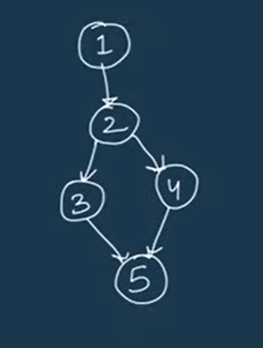
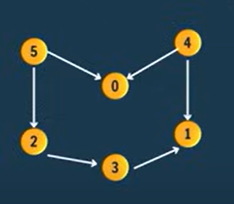
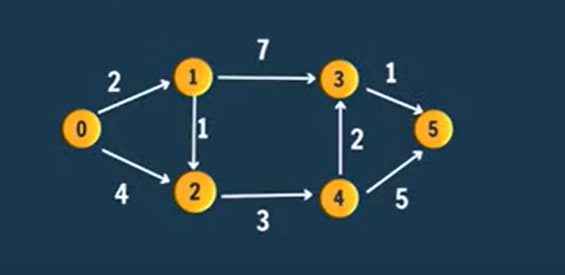
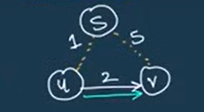
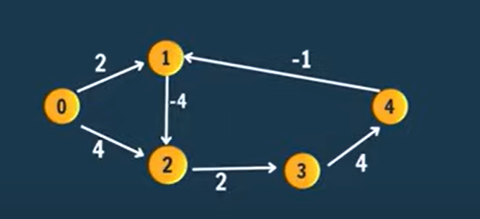
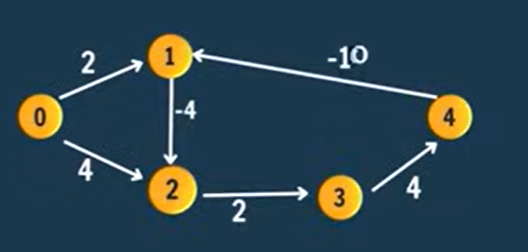
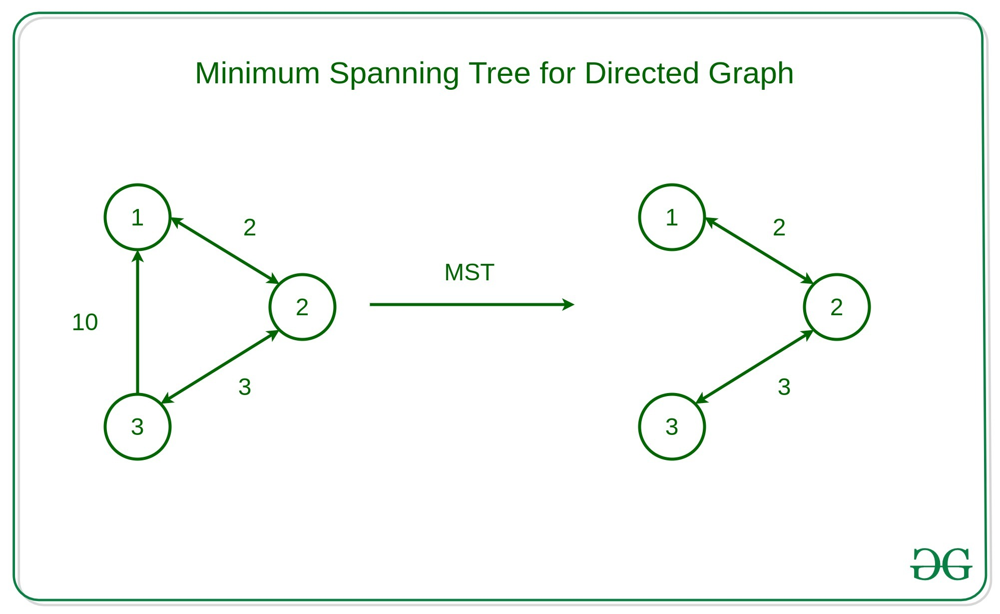
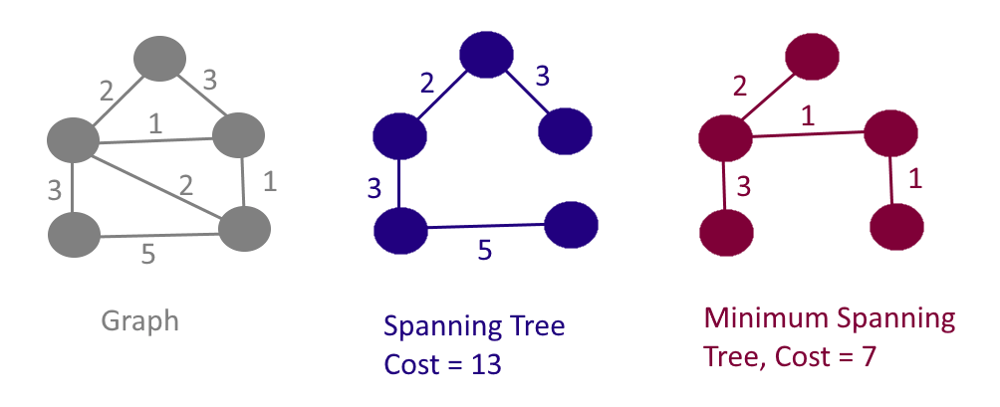
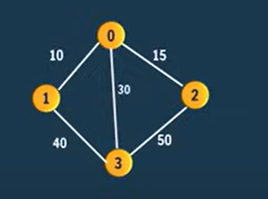

# Content
1. [Introduction](#introduction)
2. Storing a graph
    1. [Adjacency List](#adjacency-list)
    2. [Adjacency Matrix](#adjacency-matrix)
    3. [Edge List](#edge-list)
    4. [Implicit Graph](#implicit-graph)
3. Graph Traversal
    1. [Breadth first Search(BFS)](#breadth-first-searchbfs)
    2. [Depth First Search(DFS)](#depth-first-search-dfs)
4. [All Path From Source to Target](#all-path-from-source-to-target)
5. Cycle Detection
    1. [Directed Graph](#cycle-detection-in-directed-graph)
    2. [Undirected Graph](#cycle-detection-in-undirected-graph)
6. [Topological Sorting](#topological-sorting)
7. Shortest Path Algorithm
    - [Dijkstra's Algorithm](#dijkstras-algorithm)
    - [Bellman Ford Algorithm](#bellman-ford-algorithm)
8. [Minimum spanning tree(MST)](#minimum-spanning-treemst)
    - [Prim’s Algorithm](#prims-algorithm)


# Introduction
A **graph** in Data Structures and Algorithms (DSA) is a **non-linear data structure** that represents connections (relationships) between a set of nodes (also called vertices).

- Simple Definitions:
    - A graph is a collection of nodes connected by edges.
    - Graph is a network of nodes


- **Components of a Graph:**
    1. **Vertex:** A node in the graph. 
    2. **Edge:** A connection between two nodes.   

                                        


- **Type of edges**

| Edge | Meaning|
|--- | ---|
| **Directed Edge**   | Edges have direction (A ➝ B is not the same as B ➝ A).                  |
| **Undirected Edge** | Edges have no direction (A—B means A is connected to B and vice versa). |
| **Weighted Edge**   | Edges have values (like distance or cost).                              |
| **Unweighted Edge** | Edges don't carry any value.                                            |

-  **Visual Example:**

Undirected Graph
```
A —— B
|    |
D —— C
```
Directed Graph
```
A → B
↓   ↑
D → C
```
Here Node A, B, C, D are the `vertex` and line/arrow connecting those Nodes are `Edge`

- **Types of Graphs:**

| Type of Graph                        | Description                                                                 | Example Illustration        |
| ------------------------------------ | --------------------------------------------------------------------------- | --------------------------- |
| **1. Directed Graph**                | Edges have direction (A ➝ B is not the same as B ➝ A).                      | A → B ← C                   |
| **2. Undirected Graph**              | Edges have no direction (A—B means both ways).                              | A — B — C                   |
| **3. Weighted Graph**                | Each edge has a weight (e.g., distance, cost).                              | A —5— B —2— C               |
| **4. Unweighted Graph**              | Edges have no weight.                                                       | A — B — C                   |
| **5. Cyclic Graph**                  | Contains at least one cycle (closed loop).                                  | A → B → C → A               |
| **6. Acyclic Graph**                 | No cycles exist in the graph.                                               | A → B → C                   |

**Note: single graph may come under the multiple graph type at once**\
**Example:**
Directed Unweighted Acyclic Graph 
```
A → B
↓   ↑
D → C
```

- **Real-life Examples:**

| Graph Type         | Example                                      |
| ------------------ | -------------------------------------------- |
| **Social network** | Users are nodes, friendships are edges       |
| **Map**            | Cities are nodes, roads are edges            |
| **Web**            | Webpages as nodes, hyperlinks as edges       |
| **Network**        | Routers/computers are nodes, cables as edges |


[Go To Top](#content)

---

<!-- # Storing a graph

there are 4 different ways of storing a graph i.e,
1. [Adjacency List](#adjacency-list)
2. Adjacency Matrix
3. Edge List
4. 2D Matrix (Implicit Graph) -->

# Adjacency List
1. [Implementation for unweighted graph](#implementation-for-unweighted-graph)
2. [How to get neighbor](#how-to-get-the-neighboring-nodes)
3. [implementation for weighted graph](#adjacency-list-for-weighted-graph)

## Implementation for unweighted graph
- this method is also known as List of Lists
- here we give each node a index from 0 to n-1 where n is total number of vertex 
- now for each node we maintain the list which contains two things source and destination with general syntax as follow: `{source, Destination}`
- all the lists of single nodes is again stored in a another list of size n (total number of vertex) at their respective index

Example:
```
0    3
 \  / \
  2 —— 1
```
total number of vertex = 4\
therefor range of index 0 to 3 

Here we have already assign a index to each node, and that index represent that particular node

- for index 0: {0, 2}   -> here 0 is source and 2 is destination, this is same for each list
- for index 1: {{1, 2}, {1, 3}}
- for index 2: {{2, 0}, {2, 1}, {2, 3}}   
- for index 3: {{3, 1}, {3, 2}}

**Now our final Adjacency List will be:**\
**`{{0, 2}, {{1, 2}, {1, 3}}, {{2, 0}, {2, 1}, {2, 3}}, {{3, 1}, {3, 2}}}`**

**Note: in java you can implement the Adjacency list by using `hashMap`, `ArrayList of ArrayList` and `Array of ArrayList`. In above example we have implemented `Array of ArrayList`**


### How to create the Array of ArrayList?
- syntax of declaring Integer Array in java is as follow
```java
int arr[] = new int[n]  // array of int of size n
```
- in above example we have **array of type integer**, therefor to create the array of type ArrayList we just have to **replace int with ArrayList**
- type of Array  tells us what type of data is present in that Array
- **int** means in that Array at **each index a integer value is stored**, but in our example at each index there exist a ArrayLists and for that ArrayList at each index there exist a single **edge**\
**Note: in our code edge is a static class which act as a data type for declaring our ArrayList**  
- Therefor the syntax for declaring the **Array of ArrayList**
```java
ArrayList<Edge> arr[] = new ArrayList[n];   //Array of ArrayList of size n
```
- this Array of ArrayList is known as Graph
- At each index of the array we store the edges of that node
    - `arr[0]` = Edges of node 0
    - `arr[1]` = Edges of node 1
    - `arr[2]` = Edges of node 2 
    - `arr[3]` = Edges of node 3
- therefor the data store at each index of arr is as follow:
    - `arr[0]` = {0, 2}
    - `arr[1]` = {{1, 2}, {1, 3}}
    - `arr[2]` = {{2, 0}, {2, 1}, {2, 3}}
    - `arr[3]` = {{3, 1}, {3, 2}}
- Now this arr Array is our Adjacency list for our graph

### Structure of Edge
**Note: in our example we have unweighted edges, therefor we only store the source and destination for particular edge**

```java
static class Edge{
    int src;
    int dest;

    public Edge(int s, int d){
        this.src = s;
        this.dest = d;
    }
}
```

### How to add edges into the Adjacency list?
- first create our Array of ArrayList
```java
ArrayList<Edge> graph[] = new ArrayList[V];     // V is a total number of vertex
```
- Even though our graph Array is of type ArrayList at first by default before adding any data there exist a null value at each index (we cannot add any data at null)
- therefor create a empty ArrayList of type Edge at each index of that Array, soo that we can start adding data into it
```java
for (int i = 0; i< graph.length; i++){
    graph[i] = new ArrayList<Edge>();
}
```
- now as at each index of graph array there exist a ArrayList we can use `.add()` method to add the edges at each index of our Array to form our Adjacency list
- for node 0
```java
graph[0].add(new Edge(0, 2));
```
- for node 1
```java
graph[1].add(new Edge(1, 2));
graph[1].add(new Edge(1, 3));
```
- for node 2
```java
graph[2].add(new Edge(2, 0));
graph[2].add(new Edge(2, 1));
graph[2].add(new Edge(2, 3));
```
- for node 3
```java
graph[3].add(new Edge(3, 1));
graph[3].add(new Edge(3, 2));
```
**Note: each index of graph array represent a separate node who might have multiple edges**

### Complete Code
```java
import java.util.ArrayList;

public class AdjacencyList{
    static class Edge{
        int src;
        int dest;

        public Edge(int s, int d){
            this.src = s;
            this.dest = d;
        }
    }

    public static void createGraph(ArrayList<Edge> graph[]){
        for (int i = 0; i< graph.length; i++){
            graph[i] = new ArrayList<Edge>();
        }

        graph[0].add(new Edge(0, 2));

        graph[1].add(new Edge(1, 2));
        graph[1].add(new Edge(1, 3));

        graph[2].add(new Edge(2, 0));
        graph[2].add(new Edge(2, 1));
        graph[2].add(new Edge(2, 3));

        graph[3].add(new Edge(3, 1));
        graph[3].add(new Edge(3, 2));
    }
    public static void main(String[] args) {
        int V = 4;
        ArrayList<Edge> graph[] = new ArrayList[V];
        createGraph(graph);
    }
}
```

## How to get the neighboring nodes

**Note: in graph getting the neighboring nodes is most use algorithm, and in adjacency list method time complexity for getting the neighboring node is `O[E]` where E is number of edges. As this time complexity is faster than most of the other implementation and is only implemented in adjacency list we can say that adjacency list implementation of graph is the optimal implementation**

1. as each index in  Adjacency list represent its respective node, to get the neighbors of specific node we go to its specific index in Adjacency list
2. we get the ArrayList present at that index and traverse over it using for loop
```java
// printing the neighbor of node 2
for(int i = 0; i<graph[2].size(); i++){
    
}
```
3. at each index we get one Edge
```java
// printing the neighbor of node 2
for(int i = 0; i<graph[2].size(); i++){
    Edge e = graph[2].get(i);
}
```
3. Edge contains two thing first is source i.e, current node whose neighbor we are trying to find and second is destination that is all of its neighboring nodes
4. As we only want to get the neighboring node we print the destination form each index
```java
// printing the neighbor of node 2
for(int i = 0; i<graph[2].size(); i++){
    Edge e = graph[2].get(i);
    System.out.print(e.dest+" ");
}
```
#### Complete Code
```java
import java.util.ArrayList;

public class AdjacencyList{
    static class Edge{
        int src;
        int dest;

        public Edge(int s, int d){
            this.src = s;
            this.dest = d;
        }
    }

    public static void createGraph(ArrayList<Edge> graph[]){
        for (int i = 0; i< graph.length; i++){
            graph[i] = new ArrayList<Edge>();
        }

        graph[0].add(new Edge(0, 2));

        graph[1].add(new Edge(1, 2));
        graph[1].add(new Edge(1, 3));

        graph[2].add(new Edge(2, 0));
        graph[2].add(new Edge(2, 1));
        graph[2].add(new Edge(2, 3));

        graph[3].add(new Edge(3, 1));
        graph[3].add(new Edge(3, 2));
    }
    public static void main(String[] args) {
        int V = 4;
        ArrayList<Edge> graph[] = new ArrayList[V];
        createGraph(graph);

        // printing the neighbor of node 2
        for(int i = 0; i<graph[2].size(); i++){
            Edge e = graph[2].get(i);
            System.out.print(e.dest+" ");
        }
    }
}
```
**Output:**
```
0 1 3
```

## Adjacency List for Weighted graph
- before you learn about this algorithm you must know how to implemented [adjacency list for unweighted graph](#implementation-for-unweighted-graph)

- our whole approach and code remains exactly same we just add an extra field weight into our Edge class

- Therefor the general syntax for list maintain by each node becomes as `{source, Destination, Weight}`

**Complete Code**
```java
import java.util.ArrayList;

public class AdjacencyListForWeightedGraph{
    static class Edge{
        int src;
        int dest;
        int wt;     // extra field weight

        public Edge(int s, int d, int wt){
            this.src = s;
            this.dest = d;
            this.wt = wt;
        }
    }

    public static void createGraph(ArrayList<Edge> graph[]){
        for (int i = 0; i< graph.length; i++){
            graph[i] = new ArrayList<Edge>();
        }

        graph[0].add(new Edge(0, 2, 2));    // passing weight while adding the age into our graph

        graph[1].add(new Edge(1, 2, 10));
        graph[1].add(new Edge(1, 3, 0));

        graph[2].add(new Edge(2, 0, 2));
        graph[2].add(new Edge(2, 1, 10));
        graph[2].add(new Edge(2, 3, -1));

        graph[3].add(new Edge(3, 1, 0));
        graph[3].add(new Edge(3, 2, -1));
    }
    public static void main(String[] args) {
        int V = 4;
        ArrayList<Edge> graph[] = new ArrayList[V];
        createGraph(graph);

        // printing the neighbor of node 2
        for(int i = 0; i<graph[2].size(); i++){
            Edge e = graph[2].get(i);
            System.out.println(e.dest+" , " + e.wt);    // printing wt along with neighbor nodes
        }
    }
}
```
**Output:**
```
0 , 2
1 , 10
3 , -1
```
**Graph use in above example code**
```
0 ——(2)—— 2 ——(-1)—— 3
          \         /
          (10)    (0)
            \     / 
             \   /
               1
```


[Go To Top](#content)

---

# Adjacency Matrix
- An Adjacency Matrix is another way to represent a graph, using a 2D array (or matrix) of size `V x V`, where `V` is the number of vertices in the graph.
- for every `i, j` value:
    1. for unweighted graph
        - `[i, j] = 0`: edge from `i` to `j` does't exist
        - `[i, j] = 1`: edge from `i` to `j` exist
    3. for weighted graph
        - `[i, j] = 0`: edge from `i` to `j` does't exist
        - `[i, j] = n`: edge from `i` to `j` exist, also n is a weight of that edge

## Example for unweighted graph
```
0    3
 \  / \
  2 —— 1
```
From the diagram, the connections (edges) are:
- 0 — 2 ------> [0, 2] & [2, 0] = 1
- 2 — 1 ------> [2, 1] & [1, 2] = 1
- 1 — 3 ------> [1, 3] & [3, 1] = 1
- 2 — 3 ------> [2, 3] & [3, 2] = 1

Therefor Adjacency Matrix:

|  Nodes     | 0 | 1 | 2 | 3 |
| ----- | - | - | - | - |
| **0** | 0 | 0 | 1 | 0 |
| **1** | 0 | 0 | 1 | 1 |
| **2** | 1 | 1 | 0 | 1 |
| **3** | 0 | 1 | 1 | 0 |

## Example for weighted graph
**Now assign some weights (just for illustration):**
| Edge  | Weight |
| ----- | ------ |
| 0 — 2 | 5      |
| 2 — 1 | 3      |
| 1 — 3 | 4      |
| 2 — 3 | 2      |
```
0 ——(5)—— 2 ——(2)——  3
          \         /
          (3)     (4)
            \     / 
             \   /
               1
```

From the diagram, the connections (edges) are:
- 0 — 2 ------> [0, 2] & [2, 0] = 5
- 2 — 1 ------> [2, 1] & [1, 2] = 3
- 1 — 3 ------> [1, 3] & [3, 1] = 4
- 2 — 3 ------> [2, 3] & [3, 2] = 2


**Weighted Adjacency Matrix:**

|     Nodes  | 0 | 1 | 2 | 3 |
| ----- | - | - | - | - |
| **0** | 0 | 0 | 5 | 0 |
| **1** | 0 | 0 | 3 | 4 |
| **2** | 5 | 3 | 0 | 2 |
| **3** | 0 | 4 | 2 | 0 |


## Disadvantage
1. **Wastes Space for Sparse Graphs**

    - Takes `O[V²]` space (V is number of vertex) regardless of the number of edges.
    - Even if the graph has very few edges (sparse), the matrix will still have lots of zeros.
    - For example, a graph with 1000 vertices but only 10 edges will still use a 1000×1000 matrix — most entries are 0.
2. **Slow to List Neighbors**

    - To get all neighbors of a vertex v, you have to scan the entire row, which takes `O[V]` (V is number of vertex) time.
    - In adjacency list, it’s only `O[number of neighbors]` (much faster for sparse graphs).

**Note: because of this two disadvantage using ADjacency matrix in any solution is inefficient therefor we are not covering the code implementation of Adjacency Matrix**


[Go To Top](#content)

---
# Edge List
An Edge List is the simplest way to represent a graph.\
It’s just a list of all edges, where each edge connects two vertices — and can also store weights if needed.

**Format:**\
Each edge is represented as:

- For unweighted graphs: `(u, v)`
- For weighted graphs: `(u, v, weight)`


```
0    3
 \  / \
  2 —— 1
```
Edges from the diagram:

- 0 — 2
- 2 — 1
- 1 — 3
- 2 — 3
- 0 — 3

Therefor **Edge List** = `{[0, 2], [2, 1], [1, 3], [2, 3], [0, 3]}`

**Note: each edge added only once i.e, edge [0, 2] is similar to edge [2, 0]**

[Go To Top](#content)

---

# Implicit Graph

here you have given a 2D matrix and each block of this matrix is a node of a graph also adjacent cells of each block is a neighbors of that block

for n = 3\
therefor our 2D(3 x 3) array/matrix look like:
|  | | |
|---|---|---|
| | | |
| | | |

lets give temporary numbering to each block
| 1 | 2| 3|
|---|---|---|
|4 |5 |6 |
| 7| 8|9 |

here block `1, 2, 3, 4, 5, 6, 7, 8, 9` are each individual Node of a graph also neighbor of each block is as follow
| block | neighbors |
|--- | ---|
| 1 | 2, 4
| 2 | 1, 3, 5
| 3 | 2, 6
| 4 | 1, 5, 7
|5 | 2, 4, 6, 8
| 6 | 3, 5, 9
| 7 | 4, 8
| 8 | 5, 7, 9
| 9 | 6, 8

- In implicit graph each node can have maximum of 4 neighbors
- Lets assume i am at node `[i, j]` in our implicit graph therefor for this node:   
    1. `[i-1, j]`: upper neighbor 
    2. `[i+1, j]`: lower neighbor
    3. `[i, j-1]`: left neighbor
    4. `[i, j+1]`: right neighbor


[Go To Top](#content)

---
# Breadth first Search(BFS)
- BFS is a graph traversal algorithm that explores all the neighboring nodes first before going deeper into the graph.
- Unlike tree here we don't have any starting point, Therefor we chose any one node as our starting point
- Here we go to all of the neighbor of current node first
- it is a indirect **level order traversa**l (traversal algorithm of binary tree)\
[click here to learn Level order traversal in binary tree](#level-order-traversal)

**Example:**
```
  0
 / \
1   2
|   |
3---4
 \ /
  5
  |
  6
```
1. assume starting Node:- `0`, BFS = `0`
```
0
```
2. go to all of the neighbor of `0` i.e, at `1 & 2`, Therefor BFS = `0, 1, 2`
```
  0
 / \
1   2
```
3. go to the neighbor of `1` i.e, `3`, Therefor BFS = `0, 1, 2, 3`
```
  0
 / \
1   2
|   
3
```
4. before you going to the neighbor of `3` first visit the neighbor of `2`
5. go to the neighbor of `2` i.e, `4`, Therefor BFS = `0, 1, 2, 3, 4`
```
  0
 / \
1   2
|   |
3   4
```
6. go to the neighbor of `3` i.e, `4 & 5`but `4` has already visited (in step 5), Therefor BFS = `0, 1, 2, 3, 4, 5`
```
  0
 / \
1   2
|   |
3---4
 \ 
  5
```


7. go to the neighbor of `4` i.e, `3 & 5`but `3 & 5` has already visited (3 in step 3, 5 in step 6), Therefor BFS = `0, 1, 2, 3, 4, 5`
```
  0
 / \
1   2
|   |
3---4
 \ /
  5
```

8. go to the neighbor of `5` i.e, `6`, Therefor BFS = `0, 1, 2, 3, 4, 5, 6`
```
  0
 / \
1   2
|   |
3---4
 \ /
  5
  |
  6
```

**Therefor final BFS Sequence =** `0, 1, 2, 3, 4, 5, 6`


## Approach

**Note: you must know about [Adjacency list](#adjacency-list) before learning this solution**
- we use queue and array to solve this problem
- Queue:
    - we have also use in level order traversal in binary search tree to maintain the level of the tree
    - here also we use this queue to maintain the level of graph\
    [click here to learn Level order traversal in binary tree](#level-order-traversal)
    - at first queue has only one value which is our starting node
    - we perform the pop operation on this queue and which ever node it is we visit that node
- Visited Array:
    - it is use to store the visited nodes
    - size of array is equal to total number of vertex
    - each index represent its respective node
    - at first our whole array is filled with `False`
    - once we visit any node we set that index to `True`
    - `arr[i] = false`: Node `i` has not visited
    - `arr[i] = true`: Node `i` has visited
- before we visit any new Array we first check its visited Array flag
    - `flag = True` : skip that node
    - `flag = False` : visit that node
- Whenever we visit a node we perform 3 simple step
    1. print the current node
    2. set that node flag as true in visited array
    3. push the neighbor of current node into the queue


## Step by step Illustration

consider a graph
```
  0
 / \
1   2
|   |
3---4
 \ /
  5
  |
  6
```
**Step 1 : initialize**
- start with node `0`
- vis: `[false, false, false, false, false, false, false]`
- q: `[0]` 
- output: `""`

**step 2 : visit 0 (q.remove = 0)**
- `vis[0]` = `false`
    - print(0)
    - `vis[0]` = `true`
    - neighbor of 0: `1, 2`
- q: `[1, 2]`
- vis: `[true, false, false, false, false, false, false]`
- output: `"0"`

**step 3 : visit 1 (q.remove = 1)**
- `vis[1]` = `false`
    - print(1)
    - `vis[1]` = `true`
    - neighbor of 1: `0, 3`
- q: `[2, 0, 3]`
- vis: `[true, true, false, false, false, false, false]`
- output: `"0 1"`

**step 4 : visit 2 (q.remove = 2)**
- `vis[2]` = `false`
    - print(2)
    - `vis[2]` = `true`
    - neighbor of 2: `0, 4`
- q: `[0, 3, 0, 4]`
- vis: `[true, true, true, false, false, false, false]`
- output: `"0 1 2"`

**step 5 : visit 0 (q.remove = 0)**
- `vis[0]` = `true` 
    - skip it
- q: `[0, 4]`
- vis: `[true, true, true, false, false, false, false]`
- output: `"0 1 2"`

**step 6 : visit 3 (q.remove = 3)**
- `vis[3]` = `false`
    - print(3)
    - `vis[3]` = `true`
    - neighbor of 3: `1, 4, 5`
- q: `[0, 4, 1, 4, 5]`
- vis: `[true, true, true, true, false, false, false]`
- output: `"0 1 2 3"`

**step 7 : visit 0 (q.remove = 0)**
- `vis[0]` = `true` 
    - skip it
- q: `[4, 1, 4, 5]`
- vis: `[true, true, true, false, false, false, false]`
- output: `"0 1 2 3"`

**step 8 : visit 4 (q.remove = 4)**
- `vis[4]` = `false`
    - print(4)
    - `vis[4]` = `true`
    - neighbor of 4: `2, 3, 5`
- q: `[1, 4, 5, 2, 3, 5]`
- vis: `[true, true, true, true, false, false, false]`
- output: `"0 1 2 3 4"`

**step 9 : visit 1 (q.remove = 1)**
- `vis[1]` = `true` 
    - skip it
- q: `[4, 5, 2, 3, 5]`
- vis: `[true, true, true, true, false, false, false]`
- output: `"0 1 2 3 4"`

**step 10 : visit 4 (q.remove = 4)**
- `vis[4]` = `true` 
    - skip it
- q: `[5, 2, 3, 5]`
- vis: `[true, true, true, true, false, false, false]`
- output: `"0 1 2 3 4"`

**step 11 : visit 5 (q.remove = 5)**
- `vis[5]` = `false`
    - print(5)
    - `vis[5]` = `true`
    - neighbor of 5: `3, 4, 6`
- q: `[2, 3, 5, 3, 4, 6]`
- vis: `[true, true, true, true, true, true, false]`
- output: `"0 1 2 3 4 5"`

**step 12 : visit 2, 3, 5, 3, 4**
- all have `vis[i]` = `true`
    - skip them all
- q: `[6]`
- vis: `[true, true, true, true, true, true, false]`
- output: `"0 1 2 3 4 5"`

**step 13 : visit 6 (q.remove = 6)**
- `vis[6]` = `false`
    - print(6)
    - `vis[6]` = `true`
    - neighbor of 6: `5`
- q: `[5]`
- vis: `[true, true, true, true, true, true, true]`
- output: `"0 1 2 3 4 5 6"`


**step 10 : visit 5 (q.remove = 5)**
- `vis[5]` = `true` 
    - skip it
- q: `[]`
- vis: `[true, true, true, true, true, true, true]`
- output: `"0 1 2 3 4 5 6"`

**as queue is empty our approach ends, therefor we can say that we iterate util our queue get empty**

## Algorithm:
1. create the queue and boolean visited array
```java
Queue<Integer> q = new LinkedList<>();
boolean vis[] = new boolean[V];
``` 
**since array is of boolean type by default instead of null it consist of false**
2. add the starting node into the queue
```java
q.add(0)
```
3. iterate until queue gets empty
```java
while(!q.isEmpty()){
    
}
```
4. get the current visited node
```java
while(!q.isEmpty()){
    int curr = q.remove();      
}
```
5. check the whether current node has visited or not
```java
while(!q.isEmpty()){
    int curr = q.remove();
    if(vis[curr] == false){
           // has not been visited     
    }
}
```
6. print the current node and set its flag to true
```java
while(!q.isEmpty()){
    int curr = q.remove();
    if(vis[curr] == false){
        System.out.print(curr + " ");
        vis[curr] = true;
    }
}
```
7. get all the neighbor of current node and add that node into the queue\
[to learn about how to get all the neighbor](#how-to-get-the-neighboring-nodes)
```java
while(!q.isEmpty()){
    int curr = q.remove();
    if(vis[curr] == false){
        System.out.print(curr + " ");
        vis[curr] = true;
        for(int i =0; i < graph[curr].size(); i++){
            Edge e = graph[curr].get(i);
            q.add(e.dest);
        }
    }
}
```

### Code
```java
public static void bfs(ArrayList<Edge> graph[], int V){
    Queue<Integer> q = new LinkedList<>();
    boolean vis[] = new boolean[V];

    q.add(0);

    while(!q.isEmpty()){
        int curr = q.remove();
        if(vis[curr] == false){
            System.out.print(curr + " ");
            vis[curr] = true;
            for(int i =0; i < graph[curr].size(); i++){
                Edge e = graph[curr].get(i);
                q.add(e.dest);
            }
        }
    }
}
```

## Complete Code
```java
import java.util.ArrayList;
import java.util.LinkedList;
import java.util.Queue;

public class BFS{
    static class Edge{
        int src;
        int dest;

        public Edge(int s, int d){
            this.src = s;
            this.dest = d;
        }
    }

    public static void createGraph(ArrayList<Edge> graph[]){
        for (int i = 0; i< graph.length; i++){
            graph[i] = new ArrayList<Edge>();
        }

        graph[0].add(new Edge(0, 1));
        graph[0].add(new Edge(0, 2));
        
        graph[1].add(new Edge(1, 3));
        graph[1].add(new Edge(1, 0));
        
        graph[2].add(new Edge(2, 4));
        graph[2].add(new Edge(2, 0));
        
        graph[3].add(new Edge(3,1));
        graph[3].add(new Edge(3,4));
        graph[3].add(new Edge(3,5));
        
        graph[4].add(new Edge(4,2));
        graph[4].add(new Edge(4,3));
        graph[4].add(new Edge(4,5));
        
        graph[5].add(new Edge(5,3));
        graph[5].add(new Edge(5,4));
        graph[5].add(new Edge(5,6));
        
        graph[6].add(new Edge(6,5));   
    }

    public static void bfs(ArrayList<Edge> graph[], int V){
        Queue<Integer> q = new LinkedList<>();
        boolean vis[] = new boolean[V];

        q.add(0);

        while(!q.isEmpty()){
            int curr = q.remove();
            if(vis[curr] == false){
                System.out.print(curr + " ");
                vis[curr] = true;
                for(int i =0; i < graph[curr].size(); i++){
                    Edge e = graph[curr].get(i);
                    q.add(e.dest);
                }
            }
        }
    }
    public static void main(String[] args) {
        int V = 7;
        ArrayList<Edge> graph[] = new ArrayList[V];
        createGraph(graph);

        bfs(graph, V);
    }
}
```
## Output
```
0 1 2 3 4 5 6 
```

## Disconnected graph
- The graph is broken into two or more separate parts, and there's no path between some pairs of nodes.

- In outer word graph is divided into different component

**Example:**
```
Component 1:         Component 2:
   1                     3
  / \                     \
 0   2                     4

```
- In above example although `component 1` and `component 2` are separate they are consider as single graph

- Therefor our graph consist of vertex `0, 1, 2, 3, 4`
- in disconnected graph our original BFS algorithm fails at it only search for neighboring Node and will print only one component at a time
    - `start = 0`: output = `"0 1 2"`
    - `start = 4`: output = `"4 3"`
    - in both of this cases the output string is not a valid for our disconnected graph
- to solve this we update our code little 

**Update:**
1. before you return from the BFS function check for un-visited node
2. if there is any un-visited node make that node our new start and perform the BFS again for that node

**Example:**
1. perform BFS for starting node 0
    - Output = `"0 1 2"`
    - q = `[]`
    - vis = `[true, true, true, false, false]`
2. check whether for unvisited node with the help of vis array
    - as `vis[3]` = `false`
    - this says node 3 is unvisited
    - preform the BFS with starting node `3`
3. after performing the BFS with starting node `3`
    - Output = `"0 1 2 3 4"`
    - q = `[]`
    - vis = `[true, true, true, true, true]`
4. as all the index of vis array is filled with `true` that says all node have been visited therefor BFS complete


**How to check for unvisited Node**

just add one for loop which will traverse over the vis array and check for `vis[i] == false`
```java
for(int i = 0; i< V;i++){
    if(vis[i] == false){
        // call BFS again
    }
}
```

**Changes in code**
1. function will accept the few more argument i.e,
    1. graph
    2. number of vertex
    3. starting node
    4. vis array

**Note we have move the vis array from the BFS function to main function to avoid the loss of data during the function recalling**

2. call the BFS Function for all the unvisited Nodes
```java
for(int i = 0; i< V;i++){
    if(vis[i] == false){
        bfs(graph, V, i,vis);
    }
}
```
**Note: in previous approach we have call this function without for loop ,here we have calling it within the for loop soo that it will call the BFS for starting index `i = 0` to avoid the extra line of function call**

**Updated code with disconnected graph**
```java
import java.util.ArrayList;
import java.util.LinkedList;
import java.util.Queue;

public class BFS{
    static class Edge{
        int src;
        int dest;

        public Edge(int s, int d){
            this.src = s;
            this.dest = d;
        }
    }

    public static void createGraph(ArrayList<Edge> graph[]){
        for (int i = 0; i< graph.length; i++){
            graph[i] = new ArrayList<Edge>();
        }

        graph[0].add(new Edge(0, 1));
        
        graph[1].add(new Edge(1, 2));
        graph[1].add(new Edge(1, 0));
        
        graph[2].add(new Edge(2, 1));
        
        graph[3].add(new Edge(3, 4));
        
        graph[4].add(new Edge(4, 3));
    }

    public static void bfs(ArrayList<Edge> graph[], int V, int start, boolean vis[]){
        Queue<Integer> q = new LinkedList<>();
    
        q.add(start);

        while(!q.isEmpty()){
            int curr = q.remove();
            if(vis[curr] == false){
                System.out.print(curr + " ");
                vis[curr] = true;
                for(int i =0; i < graph[curr].size(); i++){
                    Edge e = graph[curr].get(i);
                    q.add(e.dest);
                }
            }
        }
    }

    public static void main(String[] args) {
        int V = 5;

        ArrayList<Edge> graph[] = new ArrayList[V];

        createGraph(graph);

        boolean vis[] = new boolean[V];

        for(int i = 0; i< V;i++){
            if(vis[i] == false){
                bfs(graph, V, i,vis);
            }
        }
    }
}
```
**Output:**
```
0 1 2 3 4
```


**Note: time complexity of the solution is `O[V + E]` where `V` is total number of `vertex` and `E` is total number of `edges`** 


[Go To Top](#content)

---
# Depth First Search (DFS)
**Before you learn about the DFS you must also know about [BFS](#breadth-first-searchbfs)**
- DFS (Depth-First Search) is a graph traversal algorithm that explores as far as possible along each branch before backtracking. It is like **going deep** into the graph before coming back.
- Here we recursively goes to the first neighbor of each node 

**Example:**
```
  0
 / \
1   2
|   |
3---4
 \ /
  5
  |
  6
```
1. assume starting Node:- `0`, DFS = `0`
```
0
```
2. go to first neighbor of Node `0` i.e, `1` therefor DFS = `0 1`
```
0
|
1
```
3. go to first neighbor of Node `1` i.e, `0` but `0` has already visited, goes to second Node i.e, `3`, therefor DFS = `0 1 3`
```
  0
 /
1
|
3
```
4. go to first neighbor of Node `3` i.e, `1` but `1` has already visited, goes to second Node i.e, `4`, therefor DFS = `0 1 3 4`
```
  0
 /
1
|
3---4
``` 
5. go to first neighbor of Node `4` i.e, `2` therefor DFS = `0 1 3 4 2`
 ```
  0
 /
1   2
|   |
3---4
```
6. go to first neighbor of Node `2` i.e, `0` but `0` has already visited, goes to second Node i.e, `4` but `4` has also visited and there is no other neighbor present. Therefor backtrack to Node `4`,  DFS = `0 1 3 4 2`
```
  0
 / \
1   2
|   |
3---4
```
7. we have already visited the first neighbor of Node `4` (step 5), go to its second neighbor i.e, `3` but `3` has already visited, go to third neighbor i.e, `5`. Therefor DFS = `0 1 3 4 2 5`
```
  0
 / \
1   2
|   |
3---4
   /
  5 
```
8. go to the first neighbor of the Node `5` i.e, `3` but `3` has already visited, go to second child i.e, `4`but `4` was also already visited,, go to third child i.e, `6`. Therefor DFS = `0 1 3 4 2 5 6`
```
  0
 / \
1   2
|   |
3---4
 \ /
  5
  |
  6 
```
**Some extra steps because of recursion**

9. go to first neighbor of Node `6` i.e, `5` but `5` has already visited and is no further child present therefor backtrack to Node `5`
10. no further child for Node `5` therefor backtrack to Node `4`, no further child for Node `4` therefor backtrack to Node `3`, no further child for Node `3` therefor backtrack to Node `1`, no further child for Node `1` therefor backtrack to Node `0`,  
11. we have already visited the first child of Node `0`, go to second child i.e, `2` but `2` has already visited and is no further child present therefor return for DFS function

final DFS sequence = `0 1 3 4 2 5 6`

## Approach

**Note: you must know about [Adjacency list](#adjacency-list) before learning this solution**
- we use array to solve this problem
- Visited Array:
    - it is use to store the visited nodes
    - size of array is equal to total number of vertex
    - each index represent its respective node
    - at first our whole array is filled with `False`
    - once we visit any node we set that index to `True`
    - `arr[i] = false`: Node `i` has not visited
    - `arr[i] = true`: Node `i` has visited
- before we visit any new Array we first check its visited Array flag
    - `flag = True` : skip that node
    - `flag = False` : visit that node
- Whenever we visit a node we perform 3 simple step
    1. print the current node
    2. set that node flag as true in visited array
    3. make recursive call for the neighbor of current node

## Step by step illustration
consider a graph
```
  0
 / \
1   2
|   |
3---4
 \ /
  5
  |
  6
```

**Step 1 : initialize**

- start with node `0`
- vis: `[false, false, false, false, false, false, false]`
- `vis[0]` = `false`
- output: `""`
- visit `0`

**step 2 : visit 0**
- print `0`
    - output: `"0"`
- `vis[0]` = `true`
    - vis: `[true, false, false, false, false, false, false]`
- first neighbor of `0` is `1`
    - `vis[1]` = `false`
    - visit `1`

**step 3 : visit 1**
- print `1`
    - output: `"0 1"`
- `vis[1]` = `true`
    - vis: `[true, true, false, false, false, false, false]`
- first neighbor of `1` is `0`
    - `vis[0]` = `true`
    - skip it
- second neighbor of `1` is `3`
    - `vis[3]` = `false`
    - visit `3`

**step 4 : visit 3**
- print `3`
    - output: `"0 1 3"`
- `vis[3]` = `true`
    - vis: `[true, true, false, true, false, false, false]`
- first neighbor of `3` is `1`
    - `vis[1]` = `true`
    - skip it
- second neighbor of `3` is `4`
    - `vis[4]` = `false`
    - visit `4`

**step 5 : visit 4**
- print `4`
    - output: `"0 1 3 4"`
- `vis[4]` = `true`
    - vis: `[true, true, false, true, true, false, false]`
- first neighbor of `4` is `2`
    - `vis[2]` = `false`
    - visit `2`

**step 6 : visit 2**
- print `2`
    - output: `"0 1 3 4 2"`
- `vis[2]` = `true`
    - vis: `[true, true, true, true, true, false, false]`
- first neighbor of `2` is `0`
    - `vis[0]` = `true`
    - skip it
- second neighbor of `2` is `4`
    - `vis[4]` = `true`
    - skip it
- there is no more neighbor fro node `2` therefor backtrack from Node `2`

**step 7 : visit 4 (continue with step 5)**
- previous steps:
    - print `4`
    - `vis[4]` = `true`
        - vis: `[true, true, false, true, true, false, false]`
    - first neighbor of `4` is `2`
        - `vis[2]` = `false`
        - visit `2`
- second neighbor of node `4` is `3`
    - `vis[3]` = `true`
    - skip is
- third neighbor of Node `4` is `5`
    - `vis[5]` = `false`
    - visit `5`

**step 8 : visit 5**
- print `5`
    - output: `"0 1 3 4 2 5"`
- `vis[5]` = `true`
    - vis: `[true, true, true, true, true, true, false]`
- first neighbor of `5` is `6`
    - `vis[6]` = `true`
    - skip it
- second neighbor of `5` is `4`
    - `vis[4]` = `true`
    - skip it
- third neighbor of `5` is `6`
    - `vis[6]` = `false`
    - visit `6`


**step 9 : visit 6**
- print `6`
    - output: `"0 1 3 4 2 5 6"`
- `vis[6]` = `true`
    - vis: `[true, true, true, true, true, true, true]`
- first neighbor of `6` is `5`
    - `vis[3]` = `true`
    - skip it
- second neighbor of `5` is `4`
    - `vis[4]` = `true`
    - skip it
- third neighbor of `5` is `6`
    - `vis[6]` = `false`
    - visit `6`
- there is no more neighbor fro node `6` therefor backtrack from Node `6`


**step 10 : visit 5 (continue with step 8)**
- previous steps:
    - print `5`
    - `vis[5]` = `true`
        - vis: `[true, true, true, true, true, true, false]`
    - first neighbor of `5` is `6`
        - `vis[6]` = `true`
        - skip it
    - second neighbor of `5` is `4`
        - `vis[4]` = `true`
        - skip it
    - third neighbor of `5` is `6`
        - `vis[6]` = `false`
        - visit `6`
- there is no more neighbor fro node `5` therefor backtrack from Node `5`

**step 11 : visit 4 (continue with step 7)**
- previous steps:
    - print `4`
    - `vis[4]` = `true`
        - vis: `[true, true, false, true, true, false, false]`
    - first neighbor of `4` is `2`
        - `vis[2]` = `false`
        - visit `2`
    - second neighbor of node `4` is `3`
        - `vis[3]` = `true`
        - skip is
    - third neighbor of Node `4` is `5`
        - `vis[5]` = `false`
        - visit `5`
- there is no more neighbor fro node `4` therefor backtrack from Node `4`

**step 12 : visit 3 (continue with step 4)**
- previous steps:
    - print `3`
    - `vis[3]` = `true`
        - vis: `[true, true, false, true, false, false, false]`
    - first neighbor of `3` is `1`
        - `vis[1]` = `true`
        - skip it
    - second neighbor of `3` is `4`
        - `vis[4]` = `false`
        - visit `4`
- third neighbor of `3` is `5`
    - `vis[5]` = `true`
    - skip it
- there is no more neighbor fro node `3` therefor backtrack from Node `3`


**step 13 : visit 1 (continue with step 3)**
- previous steps
    - print `1`
    - `vis[1]` = `true`
        - vis: `[true, true, false, false, false, false, false]`
    - first neighbor of `1` is `0`
        - `vis[0]` = `true`
        - skip it
    - second neighbor of `1` is `3`
        - `vis[3]` = `false`
        - visit `3`
- there is no more neighbor fro node `1` therefor backtrack from Node `1`


**step 14 : visit 0(continue with step 2)**
- previous steps:
    - print `0`
    - `vis[0]` = `true`
        - vis: `[true, false, false, false, false, false, false]`
    - first neighbor of `0` is `1`
        - `vis[1]` = `false`
        - visit `1`
- second neighbor of node `0` is `2`
    - `vis[2]` = `true`
    - skip is
- there is no more neighbor fro node `0` therefor backtrack from Node `0`
- once we backtrack for node `0` we complete our function and return to main

**Final output string = `"0 1 3 4  2 5 6"` (step 9)**

## Algorithm
1. accept the graph, current node and vis array 
```java
public static void dfs(ArrayList<Edge> graph[], int curr, boolean  vis[]){

}
```
2. print the current Node
```java
System.out.print(curr+" ");
```
3. set the vis flag of current node to true
```java
vis[curr] = true;
```
4. get all the neighbor of current node\
[to learn about how to get all the neighbor](#how-to-get-the-neighboring-nodes)
```java
for (int i = 0; i< graph[curr].size(); i++){
    Edge e = graph[curr].get(i);
}
```
5. check whether neighbor has been visited or not
```java
for (int i = 0; i< graph[curr].size(); i++){
    Edge e = graph[curr].get(i);
    if(vis[e.dest] == false){
        // has not been visited
    }
}
```
6. visit the neighbor by using recursion call
```java
for (int i = 0; i< graph[curr].size(); i++){
    Edge e = graph[curr].get(i);
    if(vis[e.dest] == false){
        dfs(graph, e.dest, vis);
    }
}
```

## Code
```java
public static void dfs(ArrayList<Edge> graph[], int curr, boolean  vis[]){
    System.out.print(curr+" ");
    vis[curr] = true;

    for (int i = 0; i< graph[curr].size(); i++){
        Edge e = graph[curr].get(i);
        if(vis[e.dest] == false){
            dfs(graph, e.dest, vis);
        }
    }
}
```
## Complete code
```java
import java.util.ArrayList;

public class DFS{
    static class Edge{
        int src;
        int dest;

        public Edge(int s, int d){
            this.src = s;
            this.dest = d;
        }
    }

    public static void createGraph(ArrayList<Edge> graph[]){
        for (int i = 0; i< graph.length; i++){
            graph[i] = new ArrayList<Edge>();
        }

        graph[0].add(new Edge(0, 1));
        graph[0].add(new Edge(0, 2));
        
        graph[1].add(new Edge(1, 3));
        graph[1].add(new Edge(1, 0));
        
        graph[2].add(new Edge(2, 4));
        graph[2].add(new Edge(2, 0));
        
        graph[3].add(new Edge(3,1));
        graph[3].add(new Edge(3,4));
        graph[3].add(new Edge(3,5));
        
        graph[4].add(new Edge(4,2));
        graph[4].add(new Edge(4,3));
        graph[4].add(new Edge(4,5));
        
        graph[5].add(new Edge(5,3));
        graph[5].add(new Edge(5,4));
        graph[5].add(new Edge(5,6));
        
        graph[6].add(new Edge(6,5)); 
    }

    public static void dfs(ArrayList<Edge> graph[], int curr, boolean  vis[]){
        System.out.print(curr+" ");
        vis[curr] = true;

        for (int i = 0; i< graph[curr].size(); i++){
            Edge e = graph[curr].get(i);
            if(vis[e.dest] == false){
                dfs(graph, e.dest, vis);
            }
        }
    }
    
    public static void main(String[] args) {
        int V = 7;
        ArrayList<Edge> graph[] = new ArrayList[V];
        createGraph(graph);

        boolean vis[] = new boolean[V];
        dfs(graph, 0, vis);
    }
}
```
## Output:
```
0 1 3 4 2 5 6
```

## Disconnected graph
**Note: when we call the `dfs` function for the first time we use for loop to avoid the failure of the algorithm during disconnected graph\
[click here to learn about disconnected graph and why to you for loop for that](#disconnected-graph)**

- in  `bfs` we use for loop to check for unvisited node here algo in `dfs` we use for loop for same reason to check for unvisited node 
- if there is any unvisited node that means there is disconnected graph with one unvisited component 
- to solve this issue we use for loop to check whether we have any unvisited node or not, and if have any perform `dfs` on that unvisited node

```java
import java.util.ArrayList;

public class DFS{
    static class Edge{
        int src;
        int dest;

        public Edge(int s, int d){
            this.src = s;
            this.dest = d;
        }
    }

    public static void createGraph(ArrayList<Edge> graph[]){
        for (int i = 0; i< graph.length; i++){
            graph[i] = new ArrayList<Edge>();
        }

        graph[0].add(new Edge(0, 1));
        
        graph[1].add(new Edge(1, 2));
        graph[1].add(new Edge(1, 0));
        
        graph[2].add(new Edge(2, 1));
        
        graph[3].add(new Edge(3, 4));
        
        graph[4].add(new Edge(4, 3));
    }

    public static void dfs(ArrayList<Edge> graph[], int curr, boolean  vis[]){
        System.out.print(curr+" ");
        vis[curr] = true;

        for (int i = 0; i< graph[curr].size(); i++){
            Edge e = graph[curr].get(i);
            if(vis[e.dest] == false){
                dfs(graph, e.dest, vis);
            }
        }
    }
    
    public static void main(String[] args) {
        int V = 5;
        ArrayList<Edge> graph[] = new ArrayList[V];
        createGraph(graph);

        boolean vis[] = new boolean[V];
        for(int i = 0; i< V;i++){
            if(vis[i] == false){
                dfs(graph, i, vis);
            }
        }
        
    }
}
```
**Output:**
```
0 1 2 3 4
```
**Graph use in above code**
```
Component 1:         Component 2:
   1                     3
  / \                     \
 0   2                     4
```
**Note: time complexity of the solution is `O[V + E]` where `V` is total number of `vertex` and `E` is total number of `edges`** 


[Go To Top](#content)

---

# All Path From Source to Target
**For given graph print all the path from source to target**\
**Example:**\
given graph
```
  0
 / \
1   2
|   |
3---4
 \ /
  5
  |
  6 
```

source: 0\
target: 5

Output:
```
0 1 3 4 5
0 1 3 5
0 2 4 3 5
0 2 4 5
```

## Approach

- to solve this problem we use modified version of DFS algorithm\
[to learn about DFS](#depth-first-search-dfs)
- in original DFS we travel over the whole graph, but in its modified version we specify when to end our traversal
```java
if(curr == tar){ // current == targeted
    return;
}
```
- now here we want to print each path individually, therefor instead of printing the path node by node, we maintain a separate variable for path and print that variable once we reach the target 
```java
if(curr == tar){
    System.out.println(path);   // print the path variable
    return;
}
```
- we start with `path = ""` and update this path variable every time we visit a new node or backtrack from current node
    - if we `visit` a node `add` that node into the into the path variable
    - if we `backtrack` from the node `remove` that node form the path variable

## Step by step illustration
for given graph, source = 0; target = 5
```
  0
 / \
1   2
|   |
3---4
 \ /
  5
  |
  6 
```
**Step 1 : visit 0**
- path = `"0"`

**Step 2 : visit 1**
- path = `"0 1"`

**Step 3 : visit 3**
- path = `"0 1 3"`

**Step 4 : visit 4**
- path = `"0 1 3 4"`

**Step 5 : visit 2**
- path = `"0 1 3 4 2"`
- as `0` is already visited we cannot travel to the `0`
- return -> `2` we get remove from the path

**Step 6 : visit 4 (Continue from step 4)**
- path = `"0 1 3 4"`


**Step 7 : visit 5**
- path = `"0 1 3 4 5"`
- current node = target Node
    - print(path) -> output: `0 1 3 4 5`
    - return -> remove `5` from path

**Step 8 : visit 4 (continue from step 6)**
- path = `"0 1 3 4"`
- there is no more node left Therefor
    - return -> remove `4` from path 

**Step 9 : visit 3 (continue from step 3)**
- path = `"0 1 3"`

**Step 10 : visit 5**
- path = `"0 1 3 5"`
- current node = target Node
    - print(path) -> output: `0 1 3 5`
    - return -> remove `5` from path

- **This algorithm similarly goes on for to produce two more output i.e, `0 2 4 3 5` and `0 2 4 5`**
- Therefor final outputs:
    1. `0 1 3 4 5`
    2. `0 1 3 5`
    3. `0 2 4 3 5`
    4. `0 2 4 5`

## How to use visited Array
- we cannot use vis array in traditional way as we want to visit the one node more than one time to find all the possible paths
- if we follow traditional vis array approach then according our above example when we produce output = `0 1 3 4 5` we have set the `4` vis array flag to `true`, now at the time of producing output = `0 2 4 3 5` we have `4` via array flag to `true`\
That says we cannot traverse to node `4` and cannot generate the output = `0 2 4 3 5` and `0 2 4 5`

**Therefor to solve this problem**
- we update the way we set the vis  array flag
- **we set the current node vis array flag to `true` once we go to its neighbor node and again set it to `false` once we backtrack from current node**
- **Why do this?**
    - once we backtrack from Node `4` we set that node vis array flag to `false` that is we can visit Node `4` allowing us to produce output = `0 2 4 3 5` and `0 2 4 5`
- **Do we really have to use vis Array?**\
yes! for 2 simple reason:
    1. to avoid trapping in cycle:\
    in our example check for `step 5` as if we have visited `0` again we might have trapped in a cycle vis array avoid this condition from happening
    2. to avoid going back to current node\
    in our example check for `step 6` after `2` next neighbor of node `4` is `3`, is we don't have vis array we travel back to `3` creating un-consistency
    - Therefor in general we can say that **before** travailing to any neighbor we need to make sure that edge has not been visited first and to do that we need vis array

## Algorithm
1. travel over the given graph from source 
```java
for(int i =0;i<graph[curr].size(); i++){

}
```
2. check whether the neighbor you are trying to travel has been visited or not
```java
for(int i =0;i<graph[curr].size(); i++){
    Edge e = graph[curr].get(i);
    if(!vis[e.dest]){
        // neighbor was not visited
    }
}
```
3. set the vis array flag to true for current node
```java
for(int i =0;i<graph[curr].size(); i++){
    Edge e = graph[curr].get(i);
    if(!vis[e.dest]){
        vis[curr] = true;
    }
} 
```
4. make the recursive call for neighbor, also update the path variable
```java
for(int i =0;i<graph[curr].size(); i++){
    Edge e = graph[curr].get(i);
    if(!vis[e.dest]){
        vis[curr] = true;
        printAllPath(graph, vis, e.dest, path+e.dest, tar);
    }
}
```
5. before returning from the current recursion stack make sure to set the vis array flag to false
```java
for(int i =0;i<graph[curr].size(); i++){
    Edge e = graph[curr].get(i);
    if(!vis[e.dest]){
        vis[curr] = true;
        printAllPath(graph, vis, e.dest, path+e.dest, tar); // adding neighbor node into the path aoo that once you backtrack to this node you will get you original path back
        vis[curr] = false;
    }
}
```
6. base case: print the path once reach the target and return
```java
if(curr == tar){
    System.out.println(path);
    return;
}
```
## Code
```java
public static void printAllPath(ArrayList<Edge> graph[], boolean vis[], int curr, String path, int tar){
    if(curr == tar){
        System.out.println(path);
        return;
    }

    for(int i =0;i<graph[curr].size(); i++){
        Edge e = graph[curr].get(i);
        if(!vis[e.dest]){
            vis[curr] = true;
            printAllPath(graph, vis, e.dest, path+e.dest, tar);
            vis[curr] = false;
        }
    }
}
```

## Complete code
```java
import java.util.ArrayList;

public class AllPathFromSrcToTar{
    static class Edge{
        int src;
        int dest;

        public Edge(int s, int d){
            this.src = s;
            this.dest = d;
        }
    }

    public static void createGraph(ArrayList<Edge> graph[]){
        for (int i = 0; i< graph.length; i++){
            graph[i] = new ArrayList<Edge>();
        }

        graph[0].add(new Edge(0, 1));
        graph[0].add(new Edge(0, 2));
        
        graph[1].add(new Edge(1, 3));
        graph[1].add(new Edge(1, 0));
        
        graph[2].add(new Edge(2, 4));
        graph[2].add(new Edge(2, 0));
        
        graph[3].add(new Edge(3,1));
        graph[3].add(new Edge(3,4));
        graph[3].add(new Edge(3,5));
        
        graph[4].add(new Edge(4,2));
        graph[4].add(new Edge(4,3));
        graph[4].add(new Edge(4,5));
        
        graph[5].add(new Edge(5,3));
        graph[5].add(new Edge(5,4));
        graph[5].add(new Edge(5,6));
        
        graph[6].add(new Edge(6,5)); 
    }

    public static void printAllPath(ArrayList<Edge> graph[], boolean vis[], int curr, String path, int tar){
        if(curr == tar){
            System.out.println(path);
            return;
        }

        for(int i =0;i<graph[curr].size(); i++){
            Edge e = graph[curr].get(i);
            if(!vis[e.dest]){
                vis[curr] = true;
                printAllPath(graph, vis, e.dest, path+e.dest, tar);
                vis[curr] = false;
            }
        }
    }
    
    public static void main(String[] args) {
        int V = 7;
        ArrayList<Edge> graph[] = new ArrayList[V];
        createGraph(graph);

        boolean vis[] = new boolean[V];

        int src = 0;
        int tar = 5;

        printAllPath(graph, vis, src, String.valueOf(src), tar);
        
    }
}
```
## Output:
```
01345
0135
02435
0245
```

**Note: time complexity for this code is `O[v^v]` where V is number of vertex**


[Go To Top](#content)

---
# Cycle Detection in Directed Graph

**A cycle in a directed graph (digraph) is a path that,
Starts and ends at the same node.**

Example:
```
  graph 1       graph 2
  
  1 -> 2        1 -> 2
  ↓    ↑        ↑    ↓
  4 -> 3        4 <- 3   
```
in above example we can see that graph 1 is non cyclic whereas graph 2 is cyclic

## Approach
- to solve this problem we modify `DFS` algorithm\
[click here to learn about DFA](#depth-first-search-dfs)
- **Why use DFA?**\
we are using DFA as we want to use it property of going into the depth of the graph by using recursion
    - **In DFA whenever we visit a new node we make a recursion call, adding that node into recursion stack and whenever we backtrack from that node we remove that node from the recursion stack**
    - we will be using this property of recursion to solve this problem
- Whenever we want to visit a certain node we check whether that node is already present in the recursion stack or not 
    - Node present in the recursion stack -> we have already visited that node
    - Node is not present in the recursion stack -> we have not yet visited that node
- if we have already visited that node, that means going to node will take us to a node we have already traverse upon in our past and if you go to that node it will lead to same node again and again trapping us into the cycle
- therefor we check whether that node is present in our recursion stack or not, if it present then we return true as cycle present and if not then go deeper into the graph to visit the remaining nodes

**EXample:**
```
1 -> 2
↑    ↓
4 <- 3   
```
- **initialization**
    - recursion stack = `[]`
    - start from `1`
    - as `1` is not present in the recursion stack visit `1`
- **Visit 1**
    - recursion stack = `[1]`
    - neighbor of node `1` is `2`
    - as `2` is not present in the recursion stack visit `2`
- **visit 2**
    - recursion stack = `[1 | 2]`
    - neighbor of node `2` is `3`
    - as `3` is not present in the recursion stack visit `3` 
- **visit 3**
    - recursion stack = `[1 | 2 | 3]`
    - neighbor of node `3` is `4`
    - as `4` is not present in the recursion stack visit `4` 
- **visit 4**
    - recursion stack = `[1 | 2 | 3 | 4]`
    - neighbor of node `4` is `1`
    - as `1` is exist in the recursion stack -> cycle exist
    - return `true`

### why to use recursion stack instead of visited array
**Although visited array do the same thing i.e, keep the track of the visited nodes, but because of the directed nature of the graph using visited array to check wether we have visited any node in past or not to find the cycle may cause some inconsistency**

**Example using `visited array`:**

consider the following `non-cyclic` graph 
```
  1 -> 2        
  ↓    ↑        
  4 -> 3          
```
- **initialization**
    - vis = `[false, false, false, false]`
    - start from `1`
    -  as `vis[1]` = `false` -> node is not yet visited
- **Visit 1**
    - vis = `[true, false, false, false]`
    - first neighbor of `1` is `2`
    - as `vis[2]` = `false` -> node is not yet visited
    - visit `2`
- **Visit 2**
    - vis = `[true, true, false, false]`
    - there is no neighbor for node `2`
    - backtrack to previous node i.e, node `1`
- **Visit 1**
    - vis = `[true, true, false, false]`
    - second neighbor of node `1` is `4`
    - as `vis[4]` = `false` -> node is not yet visited
    - visit `4`
- **Visit 4**
    - vis = `[true, true, false, true]`
    - first neighbor of node `4` is `3`
    - as `vis[3]` = `false` -> node is not yet visited
    - visit `3`
- **Visit 3**
    - vis = `[true, true, true, true]`
    - first neighbor of node `3` is `2`
    - as `vis[2]` = `true` -> we have visited node `2` in the past
    - according to recursion stack approach if we are reaching to any node we have visited in our past will cause cycle to form
    - therefor as visited array says we have already visited node `2` in past we get final answer as `cycle present` even though our graph is `non-cyclic`

**Example using `recursion stack:`**

consider the following `non-cyclic` graph 
```
  1 -> 2        
  ↓    ↑        
  4 -> 3          
```
- **initialization**
    - recursion stack = `[]`
    - start from `1`
    - as `1` is not present in the recursion stack visit `1`
- **Visit 1**
    - recursion stack = `[1]`
    - first neighbor of node `1` is `2`
    - as `2` is not present in the recursion stack visit `2`
- **visit 2**
    - recursion stack = `[1 | 2]`
    - as there is no neighbor for node `2`, backtrack to previous node i.e, `1`
    - once you backtrack from `2` will get remove from the recursion stack
- **Visit 1**
    - recursion stack = `[1]`
    - second neighbor of node `1` is `4`
    - as `4` is not present in the recursion stack visit `4`
- **Visit 4**
    - recursion stack = `[1 | 4]`
    - neighbor of node `4` is `3`
    - as `3` is not present in the recursion stack visit `3`
- **Visit 3**
    - recursion stack = `[1 | 4 | 3]`
    - neighbor of node `3` is `2`
    - as `2` is not present in the recursion stack visit `2`
- **Visit 2**
    - recursion stack = `[1 | 4 | 3 | 2]`
    - as there is no neighbor for node `2` and we have traverse over our whole graph, we will continuously backtrack towards where we have started
- as during whole traversal there was no node present in the recursion stack we can say that there is `no cycle`

### How to handle recursion stack
- from the approach we can see that we want to perform the search operation on this recursion stack very frequently
- The search time complexity of graph is `o[n]` which is quite high fro frequently performing operation
- To solve this issue we use `Array`, as array has search time complexity of `o[1]` which is very low compare to stack
- Therefor to make this `array(res)` to behave like recursion stack:
    - this array(res) will be **same as that of visited array** i.e, boolean array of size `V` where `V` is number of vertex and each index of array is initially filled with false.
    -  `res[i] = true`   -> node `i` is present in recursion stack
    -  `res[i] = false`   -> node `i` is not present in recursion stack
    - whenever we visit any node we set that node res flag to `true` to indicate that node in has added into the recursion stack
    - whenever we backtrack from any node we set that node res flag to `false` to indicate that node in has remove from recursion stack

### Algorithm

1. set the vis and res flag of current node to true
```java
vis[curr] = true;
rec[curr] = true;
```
2. get all of the neighbor of the current node\
[to learn about how to het all neighbor](#how-to-get-the-neighboring-nodes)
```java
for(int i = 0; i<graph[curr].size(); i++){
    Edge e = graph[curr].get(i);
}
```
3. check whether any neighbor present in the recursion stack or not and if it present then return true
```java
for(int i = 0; i<graph[curr].size(); i++){
    Edge e = graph[curr].get(i);
    if(rec[e.dest]){    // present in recursion stack
        return  true;
    }
}
```
4. if neighbor is not present in the recursion stack then check whether we have yet visited that node or not?
```java
for(int i = 0; i<graph[curr].size(); i++){
    Edge e = graph[curr].get(i);
    if(rec[e.dest]){
        return  true;
    }else if(!vis[e.dest]){     // not yet visited
        
    }
}
```
5. if neighbor is not yet visited then recursively check whether any cycle present in for that neighbor or not and return true only if it present
```java
for(int i = 0; i<graph[curr].size(); i++){
    Edge e = graph[curr].get(i);
    if(rec[e.dest]){
        return  true;
    }else if(!vis[e.dest]){
        if(isCyclePresent(graph, vis, e.dest, rec)){
            return true;
        }
    }
}
```
6. Above for loop will return true if any cycle detected, if we successfully reach the outside the for loop then that means no cycle detected 
7. since no cycle detected backtrack by returning false and removing the current node from recursive stack
```java
rec[curr] = false;
return  false;
```
### Code
```java
public static boolean isCyclePresent(ArrayList<Edge> graph[], boolean vis[], int curr, boolean rec[]){
    vis[curr] = true;
    rec[curr] = true;

    for(int i = 0; i<graph[curr].size(); i++){
        Edge e = graph[curr].get(i);
        if(rec[e.dest]){
            return  true;
        }else if(!vis[e.dest]){
            if(isCyclePresent(graph, vis, e.dest, rec)){
                return true;
            }
        }
    }
    rec[curr] = false;
    return  false;
}
```

**Note: to avoid the inconsistency caused by disconnected graph we use for loop to call this function**\
[to learn about disconnected graph and why to use for loop](#disconnected-graph)
```java
for(int i = 0; i< V; i++){
    if(!vis[i]){
        // call the function
    }
}
```
before we call the function again we will check whether the result of current call is true or false

- true -> cycle detected
- false -> cycle not detected

if result is true then then there is no need to check for remaining graph as cycle already detected. Therefor break through loop

if result is false then then we have to check for remaining graph as cycle might present in that remaining portion of the graph
```java
for(int i = 0; i< V; i++){
    if(!vis[i]){
        if(isCyclePresent(graph, vis, i, rec)){
            System.out.println("true");
            break;
        }
    }
}
```
### Complete code
```java
import java.util.ArrayList;

public class CycleDetectionInDirectedGraph {
    static class Edge {
        int src;
        int dest;
        public Edge(int s, int d) {
            this.src = s;
            this.dest = d;
        }
    }
    static void createGraph(ArrayList<Edge> graph[]) {
        for(int i=0; i<graph.length; i++) {
            graph[i] = new ArrayList<>();
        }
        graph[0].add(new Edge(0, 2));

        graph[1].add(new Edge(1, 0));

        graph[2].add(new Edge(2, 3));

        graph[3].add(new Edge(3, 0));
    }  

    public static boolean isCyclePresent(ArrayList<Edge> graph[], boolean vis[], int curr, boolean rec[]){
        vis[curr] = true;
        rec[curr] = true;

        for(int i = 0; i<graph[curr].size(); i++){
            Edge e = graph[curr].get(i);
            if(rec[e.dest]){
                return  true;
            }else if(!vis[e.dest]){
                if(isCyclePresent(graph, vis, e.dest, rec)){
                    return true;
                }
            }
        }
        rec[curr] = false;
        return  false;
    }   
    
    public static void main(String[] args) {
        int V = 5;
        ArrayList<Edge> graph[] = new ArrayList[V];
        createGraph(graph);

        boolean vis[] = new boolean[V];
        boolean rec[] = new boolean[V];

        for(int i = 0; i< V; i++){
            if(!vis[i]){
                if(isCyclePresent(graph, vis, i, rec)){
                    System.out.println("true");
                    break;
                }
            }
        }
    }
}
```
### Output:
```
true
```
### Graph in above example
```
0 -> 1
↑    ↓
3 <- 2   
```

[Go To Top](#content)

---

# Cycle Detection In Undirected Graph
**A cycle in a directed graph (digraph) is a path that,
Starts and ends at the same node.**

Example:
```
Graph 1       Graph 2
  0             0
 / \           / \
1   2         1   2
|   |         |  / \  
3---4         3 4   5
 \ /
  5
  |
  6  
```
in above example we can see that graph 1 is  cyclic whereas graph 2 is non cyclic

<!-- **Note: to solve this problem we modify [DFA](#depth-first-search-dfs) algorithm** -->

### What will be the condition for cycle detection?

to find cycle whenever we want to visit a certain node we check whether that node is already visited or not

if we have already visited that node, that means going to node will take us to a node we have already traverse upon in our past and if you go to that node it will lead to same node again and again trapping us into the cycle

but since our graph is undirected we have to also check for parent node because in every cases parent node is already visited but it will not form a cycle

**Parent Node: node through which we came to current node**

lets consider a graph
```
0---1
 \ /
  2
  |
  3
```
- we start from `0`, go to vertex `1`
- at vertex `1` we have two neighbor i.e, `0` and `2`
- but for `1` vertex `0` is already visited but is a parent node hence it will not form a cycle, therefor we go to vertex `2`
- at `2` we have three vertex
    1. vertex `1` : already visited and is parent of `2`
    2. vertex `0` : already visited and is not a parent of `2`
    3. vertex `3` : not yet visited
- `0` being the neighbor of `2` we can say that the cycle is present in the given graph

- Therefor from this observation we can say that:
    1. each vertex can have maximum three type of the neighbors:
        1. already visited and is parent
        2. already visited and is not a parent
        3. not yet visited
    2. out of this three condition if any neighbor satisfy the condition `b(already visited and is not a parent)` then there exist a cycle 
    3. for condition `a(already visited and is parent)` we have to do nothing 
    4. for condition `c(not yet visited)` just go to that node and check for cycle in that child graph\
    **Note: if cycle is not present in current child graph then there might be the chances of having cycle in the remaining graph**

- **back edge:** edge in which the destination is already visited but is not the parent \
in our example `edge[2, 3]` is a back edge

Therefor the condition to detect the cycle in undirected graph is as follow:\
**There must exist at least one back edge**

To find the back edge you must have to find the neighbor who satisfy the condition : **already visited and is not a parent**


### Approach
1. to solve this problem we modify [DFA](#depth-first-search-dfs) algorithm as DFS keep the track of visited node
2. for each neighbor we check in which type this neighbor falls into i.e,
    1. already visited and is parent
    2. already visited and is not a parent
    3. not yet visited
3. specially check for condition `b(already visited and is not a parent)`  if any neighbor satisfy this condition then return true
4. for condition `a(already visited and is parent)` just skip that node
5. only visit the neighbor if it satisfy the condition `c(not yet visited)` by using recursion and check whether this node return true(cycle present) or false(cycle not present)
6. return true if recursive call also return true and if recursive call return false then do nothing as cycle might present in remaining graph

### Algorithm
1. set the current Node vis flag to true
```java
vis[curr] = true;
```
2. get all the neighbor of the current node\
[click here to learn about how to get the neighbor of any node](#how-to-get-the-neighboring-nodes)
```java
for (int i = 0; i< graph[curr].size(); i++){
    Edge e = graph[curr].get(i);
}
```
3. for each node check whether that neighbor is already visited and is not a parent or not yet visited (skip the condition already visited and is parent)
```java
for (int i = 0; i< graph[curr].size(); i++){
    Edge e = graph[curr].get(i);

    if(vis[e.dest] && e.dest != par){
        // already visited and is not a parent
    }else if(!vis[e.dest]){
        // not yet visited
    }
}
```
4. if any neighbor is already visited and is not a parent then return true as cycle present 
```java
for (int i = 0; i< graph[curr].size(); i++){
    Edge e = graph[curr].get(i);

    if(vis[e.dest] && e.dest != par){
        return true;
    }else if(!vis[e.dest]){
        // not yet visited
    }
}
```
5. if any neighbor is not yet visited then make recursive call for that neighbor. As cycle might present in tha child graph and return true only if cycle present int that child graph, else do nothing as cycle might present in the remaining graph
```java
for (int i = 0; i< graph[curr].size(); i++){
    Edge e = graph[curr].get(i);

    if(vis[e.dest] && e.dest != par){
        return true;
    }else if(!vis[e.dest]){
        if(isCyclePresent(graph,  vis,e.dest, curr)){
            return true;
        }
    }
}
```
6. above for loop we detect any cycle if it present if there is no cycle present the return  false
```java
return false;
```
### Code
```java
public static boolean isCyclePresent(ArrayList<Edge> graph[], boolean  vis[], int curr, int par){
    vis[curr] = true;
    for (int i = 0; i< graph[curr].size(); i++){
        Edge e = graph[curr].get(i);

        if(vis[e.dest] && e.dest != par){
            return true;
        }else if(!vis[e.dest]){
            if(isCyclePresent(graph,  vis,e.dest, curr)){
                return true;
            }
        }
    }
    return  false;
}
```
### Complete code
```java
import java.util.ArrayList;

public class cycleDetectionInUndirectedGraph{
    static class Edge{
        int src;
        int dest;

        public Edge(int s, int d){
            this.src = s;
            this.dest = d;
        }
    }

    public static void createGraph(ArrayList<Edge> graph[]){
        for (int i = 0; i< graph.length; i++){
            graph[i] = new ArrayList<Edge>();
        }

        graph[0].add(new Edge(0, 1));
        graph[0].add(new Edge(0, 4));

        graph[1].add(new Edge(1, 0));
        graph[1].add(new Edge(1, 2));
        graph[1].add(new Edge(1, 4));

        graph[2].add(new Edge(2, 1));
        graph[2].add(new Edge(2, 3));

        graph[3].add(new Edge(3, 2));

        graph[4].add(new Edge(4, 0));
        graph[4].add(new Edge(4, 1));
        graph[4].add(new Edge(4, 5));

        graph[5].add(new Edge(5, 4));
    }

    public static boolean isCyclePresent(ArrayList<Edge> graph[], boolean  vis[], int curr, int par){
        vis[curr] = true;
        for (int i = 0; i< graph[curr].size(); i++){
            Edge e = graph[curr].get(i);

            if(vis[e.dest] && e.dest != par){
                return true;
            }else if(!vis[e.dest]){
                if(isCyclePresent(graph,  vis,e.dest, curr)){
                    return true;
                }
            }
        }
        return  false;
    }
    
    public static void main(String[] args) {
        int V = 7;
        ArrayList<Edge> graph[] = new ArrayList[V];
        createGraph(graph);

        boolean vis[] = new boolean[V];
        
        System.out.print(isCyclePresent(graph, vis, 0, -1));
        
    }
}
```
### Output:
```
true
```


[Go To Top](#content)

---


# Topological Sorting

**Note: Topological sorting is used only on `DAG's`(Directed Acyclic Graph)**

Topological Sort is a linear ordering of the vertices of a Directed Acyclic Graph (DAG) such that for every directed edge `u → v`, vertex `u` comes before vertex `v` in the ordering.

#### Example:
consider a following graph


edges in this graph
```
a -> b      # u = a and v = b
b -> c      # u = b and v = c
a -> c      # u = a and v = c
c -> d      # u = c and v = d
```
for all the edges in the above graph `u` comes before `v`, therefor we can say that above graph s **topologically sorted**.


### Topological Sorted Order
linear sequence of all vertices in a Directed Acyclic Graph (DAG) where each node appears before all nodes it points to.

for above example topological sorted order is: `a b c d`

**Explanation:**
- in our graph `a` comes before `b` and `c`, therefor in our sequence `a` must appear before `b` and `c`
- in our graph `b` comes before  `c`, therefor in our sequence `b` must appear before `c`
- in our graph `c` comes before  `d`, therefor in our sequence `c` must appear before `d`

**Note: Topological Sort is not a traversal algorithm itself, but it uses traversal (like DFS) to produce a sorted order of nodes based on dependencies.**

### Why we need topological sort

**To maintain dependency**

- suppose we have to write a java code for which we have some series of action as follow:
    1. buy a laptop
    2. install os
    3. install code editor
    4. install java
    5. write code
- for us to properly write a code we must have to follow a specific sequence i.e, we cant write a java code without installing java and to install java we need OS 

- hence we can  say that to write java we need both code editor and java installed i.e, without installing code editor and java we cannot write the java code. Therefor we can say that writing code is dependent on installing code editor and installing java it doesn't in which order they get install
- but to install java and code editor we need OS without which cannot install them both and to install OS we need a laptop
- Therefor to write a java code our sequence must be: 
    1. buy a laptop
    2. install os
    3. install code editor 
    4. install java
    5. write code

- lets assume each Vertex of the graph represent the single action then our graph structure is like:



**Note: this graph is always a Directed Acyclic Graph (DAG)**

- as node `1` come before `2` -> action `1(buying a laptop)` must perform before `2(installing OS)`
- as node `2` come before `3` and `4` -> action `2(installing OS)` must perform before `3(installing code editor)` and `4(installing java)`

- since installing code editor and installing java are two independent thing they are not dependent on each other therefor  we can have them at single level i.e, we can first install java then the code editor or we can first install code editor then java in both of the cases our final goal can be achievable

- as node `3` and `4` come before node `5` -> action `3(installing code editor)` and `4(installing java)` must perform before `5(writing java code)`
- as we need both code editor and java installed to write the java code

- for this graph our topological sorted order is :
```
1 2 3 4 5
    or
1 2 4 3 5
```
as it doesn't matter which action we perform `action 3(install code editor)` or `action 4(install java)`

- but order cannot be:
```
1 2 3 5 4
```
as we cannot perform `action 5(write java code)` before `action 4(install java)`

- this topological order tells us how our dependency is, like for order `1 2 3 4 5`
    - to perform `action 3(install code editor)` we must have to complete `action 1(buy laptop) & 2(install OS)` as `1` and `2` came before `3`

### Approach
1. to solve this problem we use modified version of [DFS](#depth-first-search-dfs) and [Stack Data structure](../stack/readme.md)
2. from the above explanation we can  make the conclusion that says we need to print the vertex first then its neighbor
3. Although DFS do the same i.e, print the vertex first then its neighbor, it start from the random vertex which may cause some inconsistency
4. therefor to solve this issue we need to store the vertexes separately and in topological order
5. to do that we use stack: **whenever we return from the DFS code we push the current node into the stack**
```java
public static void topSort(ArrayList<Edge> graph[], int curr, boolean  vis[], Stack<Integer> stack){
    vis[curr] = true;

    for (int i = 0; i< graph[curr].size(); i++){
        Edge e = graph[curr].get(i);
        if(vis[e.dest] == false){
            topSort(graph, e.dest, vis, stack);
        }
    }
    // all os the above code is a code of DFS
    stack.push(curr);   // push the current node into the stack 
}
```
#### Why to push node into the stack
consider a graph with topological order: `5 4 2 3 1 0`



from above graph we can say that `5` came before `2 3 1`, therefor somehow if we manage to push the `5` in the stack while `2 3 1` are at the bottom of the stack then we can abel to store our topological sequence

- from this observation we can say that before we push current node into the stack we have to push all of  its neighbor into the stack first
- this is possible because of the recursive approach of the DFS algorithm
- we recursively reach the node `1` by traversing over `2, 3`, now as we return on the way we push `1, 3, 2` into the stack where `2` is on top of the `3` and `1`
- now if we try to print our stack(Last In First Out) we get sequence as follow: `2 3 1`

### Step by Step Illustration


**Initialize:**
- vis = `[false, false, false, false, false, false]`
- stack = `[]`
- start with vertex `0`

**Step 1 : Visit 0:**
- `vis[0]` = `true`
    - vis = `[true, false, false, false, false, false]`
- vertex `0` has zero neighbor 
- push `0` into the stack
- stack = `[0]`
- return

As vertex `1` is not visited yet we visit `1`

**Step 2 : Visit 1:**
- `vis[1]` = `true`
    - vis = `[true, true, false, false, false, false]`
- vertex `1` has zero neighbor 
- push `1` into the stack
- stack = `[0 | 1]`
- return

As vertex `2` is not visited yet we visit `2`

**Step 3 : Visit 2:**
- `vis[2]` = `true`
    - vis = `[true, true, true, false, false, false]`
- neighbor of `2` is `3`
- visit `3`

**Step 4 : visit 3**
- `vis[3]` = `true`
    - vis = `[true, true, true, true, false, false]`
- neighbor of `3` is `1`, but `1` is `already visited`
- Therefor push `3` into the stack
- stack = `[0 | 1 | 3]`
- return

**Step 5 : Visit 2 (continue with step 3):**
- previous steps:
    - `vis[2]` = `true`
        - vis = `[true, true, true, false, false, false]`
    - neighbor of `2` is `3`
    - visit `3`
- vertex `2` has no neighbor left
- Therefor push `2` into the stack
- stack = `[0 | 1 | 3 | 2]`
- return

As vertex `4` is not visited yet we visit `4`

**Step 6 : Visit 4:**
- `vis[4]` = `true`
    - vis = `[true, true, true, true, true, false]`
- neighbor of `4` is `0` and `1`, since both `0` and `1` is already visited
- push `4` into the stack
- stack = `[0 | 1 | 3 | 2 | 4]`
- return

As vertex `5` is not visited yet we visit `5`

**Step 7 : Visit 5:**
- `vis[5]` = `true`
    - vis = `[true, true, true, true, true, true]`
- neighbor of `5` is `0` and `2`, since both `0` and `2` is already visited
- push `5` into the stack
- stack = `[0 | 1 | 3 | 2 | 4 | 5]`
- return

**Step 8: print the stack**
- since stack follow LIFO(Last In First Out) approach the vertex which is added last will be print first
- therefor our final topological sequence is: `5 4 2 3 1 0`

### Algorithm:
- our algorithm for this problem remain the same as that of the DFS algorithm
- only difference is  instead of printing the current node we push tat node before we backtrack
- once we complete our code we just print the stack
```java
while(!stack.isEmpty()){
    System.out.print(stack.pop()+" ");
}
```

### Code
```java
// this is the same code snippet as that of the DFS algorithm
public static void topSort(ArrayList<Edge> graph[], int curr, boolean  vis[], Stack<Integer> stack){
    vis[curr] = true;   // removed the print statement 

    for (int i = 0; i< graph[curr].size(); i++){
        Edge e = graph[curr].get(i);
        if(vis[e.dest] == false){
            topSort(graph, e.dest, vis, stack);
        }
    }
    stack.push(curr);   // added the statement to push the curr node into the stack
}

// function to print the stack
public static void printTopSort(ArrayList<Edge> graph[]){
    boolean vis[] = new boolean[graph.length];
    Stack<Integer> stack = new Stack<>();

    for(int i = 0; i< graph.length;i++){
        if(vis[i] == false){
            topSort(graph, i, vis,stack);
        }
    }

    // print the stack
    while(!stack.isEmpty()){
        System.out.print(stack.pop()+" ");
    }
}
```

### Complete code
```java
import java.util.ArrayList;
import java.util.Stack;

public class TopologicalSort{
    static class Edge{
        int src;
        int dest;

        public Edge(int s, int d){
            this.src = s;
            this.dest = d;
        }
    }

    public static void createGraph(ArrayList<Edge> graph[]){
        for (int i = 0; i< graph.length; i++){
            graph[i] = new ArrayList<Edge>();
        }

        graph[2].add(new Edge(2, 3));

        graph[3].add(new Edge(3, 1));

        graph[4].add(new Edge(4, 0));
        graph[4].add(new Edge(4, 1));

        graph[5].add(new Edge(5, 0));
        graph[5].add(new Edge(5, 2));
    }

    public static void topSort(ArrayList<Edge> graph[], int curr, boolean  vis[], Stack<Integer> stack){
        vis[curr] = true;

        for (int i = 0; i< graph[curr].size(); i++){
            Edge e = graph[curr].get(i);
            if(vis[e.dest] == false){
                topSort(graph, e.dest, vis, stack);
            }
        }
        stack.push(curr);
    }
    
    public static void printTopSort(ArrayList<Edge> graph[]){
        boolean vis[] = new boolean[graph.length];
        Stack<Integer> stack = new Stack<>();

        for(int i = 0; i< graph.length;i++){
            if(vis[i] == false){
                topSort(graph, i, vis,stack);
            }
        }

        while(!stack.isEmpty()){
            System.out.print(stack.pop()+" ");
        }
    }

    public static void main(String[] args) {
        int V = 6;
        ArrayList<Edge> graph[] = new ArrayList[V];
        createGraph(graph);

        printTopSort(graph);   
    }
}
```
### Output
```
5 4 2 3 1 0
```
**Note: time complexity of the solution is `O[V + E]` where `V` is total number of `vertex` and `E` is total number of `edges`**

[Go To Top](#content)

---

# Dijkstra's Algorithm

it is algorithm to find the shortest **distance** from source to all the vertex in weighted graph

Example:\
consider a graph



now assuming source as `0` our shortest distance for each node is as follow:
- node `0` : `0` 
- node `1` : `2` 
- node `2` : `3` (0 -> 1 -> 2)
- node `3` : `8` (0 -> 1 -> 2 -> 4 -> 3)
- node `4` : `6` (0 -> 1 -> 2 -> 4)
- node `5` ; `9` (0 -> 1 -> 2 -> 4 -> 3 -> 5)

therefor as a output we get a array in which at each index represent the destination and hold's the value of shortest distance

**actual output of the Dijkstra's algorithm:** `[0, 2, 3, 8, 6, 9]`

at index `2` we have `3` that means shortest distance between source (`0`) and node `2`(destination) is `3`

### Relaxation

relaxation is the process of updating the shortest known distance to a vertex if a shorter path is found through another vertex.



- in above example we have a graph where source is `S` and destination is `V` and an another node `u`
- between `S` and `V, u` there is indirect edge, whereas between `u` and `V` there is direct edge
- **indirect Edge:** the edge may consist some nodes on the way

example: consider a graph
```
s —— a —— b —— u
```
from this graph we can say that there is a indirect edge between `s` and `u` with node `a` and `b` in between
```
s ----- u
```
- **direct edge:** there is no node in between (between two neighbor there exist a direct edge)

example: consider a graph
```
s —— a —— b —— u
```
between node `s - a`, `a - b` and `b - u` there is a direct edge
- if we have found that current distance between `S` and `V` is `5`
```java
dis[v] = 5
``` 
- shortest distance between `S` and `u` is `1`
```java
dis[u] = 1
``` 
- since `u` is a neighbor of `V` with edge weight `2` therefor there exist a path between `S` and `V` vie `u` with distance `1 + 2 = 3`
```java
dis[u] + wt = 3
``` 
- now if you compare current  distance and newly found distance (vie `u`) then we can say that `current distance (5)` > `new distance (3)` 
```java
dis[v] + wt < dis[v]
```
- since new distance is shorter than current distance we update the current distance by assigning the value of shortest distance to current distance
```java
dis[v] = dis[u] + wt
```

**Condition of Relaxation:**
```java
if (distance[u] + weight(u, v) < distance[v]) {
    distance[v] = distance[u] + weight(u, v);
}
```

### Priority Queue

**To solve dijkstra's algorithm we use priority queue**

**before learning about priority queue make sure you know about the [Queue data structure](../Queue/Readme.md)**

- **A priority queue is a special type of queue where each element has a priority, and the element with the highest priority is served first.**\
example: \
Queue has two element 1(high priority) and 3(low priority) then no matter in which order they have inserted into the queue, whenever we perform the pop operation on queue the element with high priority will pop first

- It  also follow FIFO approach

- **by default lower values has higher priority i.e, `1` has high priority that `5`**

- element with higher priority will always comes first irrespective of their order of insertion

Example:\
consider a empty queue 
```
q = []
```
1. **add 1**
```
q = [1]
```
2. **add 5**
```
q = [1 | 5]
```
3. **add 7**
```
q = [1 | 5 | 7]
```
4. **add 0 (high priority)**
```
q = [0 | 1 | 5 | 7]
```


5. **add 3**
```
q = [0 | 1 | 3 | 5 | 7]
```

### Approach
 **we use greedy approach to solve this problem**


let say in above graph our source node is `0`, therefor at first we have following data with us
- **dis = `[0, infinite, infinite, infinite, infinite, infinite]`**\
as we are starting from node `0` we can say that distance between `0-0` is `0`, whereas we don't know the distance between `0 and other` nodes that why we assume it to be `infinite`
- **vis = `[false, false, false, false, false, false]`**\
as we have not yet visited any node, each node represent whether we have visited that node or not

**For Dijkstra's algorithm we perform three simple steps**
1. we search for any unvisited node with shortest distance 
3. set its visited flag to true
3. once we find that node we visit that node and find its neighbor and perform relaxation for each neighbor to check whether we have shorter distance for that neighbor vie current node or not  

### Illustration
- **Initialization:**
    - dis = `[0, infinite, infinite, infinite, infinite, infinite]`
    - vis = `[false, false, false, false, false, false]`

- **step 1 : visit 0 (unvisited node with shortest distance)**
    - `vis[0]` = `true`
    - neighbor of `0` = `1` and `2`
    - for neighbor `1`
        - source = `0`
        - destination = `1`
        - weight = `2`
        - relaxation:
            - `dis[source]` = `0`

            - `dis[source] + weight` = 0 + 2 = `2`

            - `dis[destination]` = `infinite`

            - as `dis[source] + weight < dis[destination]` -> `dis[destination] = dis[source] + weight`
    - for neighbor `2`
        - source = `0`
        - destination = `2`
        - weight = `4`
        - relaxation:
            - `dis[source]` = `0`

             - `dis[source] + weight` = 0 + 4 = `4`

            - `dis[destination]` = `infinite`

            - as `dis[source] + weight < dis[destination]` -> `dis[destination] = dis[source] + weight`
    - update:
        - dis = `[0, 2, 4, infinite, infinite, infinite]`
        - vis = `[true, false, false, false, false, false]`
- **step 2 : visit 1 (unvisited node with shortest distance)**
    - `vis[1]` = `true`
    - neighbor of `1` = `2` and `3`
    - for neighbor `2`
        - source = `1`
        - destination = `2`
        - weight = `1`
        - relaxation:
            - `dis[source]` = `2`

            - `dis[source] + weight` = 2 + 1 = `3`

            - `dis[destination]` = `4`

            - as `dis[source] + weight < dis[destination]` -> `dis[destination] = dis[source] + weight`
    - for neighbor `3`
        - source = `2`
        - destination = `3`
        - weight = `7`
        - relaxation:
            - `dis[source]` = `2`

            - `dis[source] + weight` = 2 + 7 = `9`

            - `dis[destination]` = `infinite`

            - as `dis[source] + weight < dis[destination]` -> `dis[destination] = dis[source] + weight`
    - update:
        - dis = `[0, 2, 3, 9, infinite, infinite]`
        - vis = `[true, true, false, false, false, false]`


- **step 3 : visit 2 (unvisited node with shortest distance)**
    - `vis[2]` = `true`
    - neighbor of `2` = `4`
    - for neighbor `4`
        - source = `2`
        - destination = `4`
        - weight = `3`
        - relaxation:
            - `dis[source]` = `3`

            - `dis[source] + weight` = 3 + 3 = `6`

            - `dis[destination]` = `infinite`

            - as `dis[source] + weight < dis[destination]` -> `dis[destination] = dis[source] + weight`
    - update:
        - dis = `[0, 2, 3, 9, 6, infinite]`
        - vis = `[true, true, true, false, false, false]`

- **step 4 : visit 4 (unvisited node with shortest distance)**
    - `vis[4]` = `true`
    - neighbor of `4` = `3` and `5`
    - for neighbor `3`
        - source = `4`
        - destination = `3`
        - weight = `2`
        - relaxation:
            - `dis[source]` = `6`

            - `dis[source] + weight` = 6 + 2 = `8`

            - `dis[destination]` = `9`

            - as `dis[source] + weight < dis[destination]` -> `dis[destination] = dis[source] + weight`
    - for neighbor `5`
        - source = `4`
        - destination = `5`
        - weight = `5`
        - relaxation:
            - `dis[source]` = `6`

            - `dis[source] + weight` = 6 + 5 = `11`

            - `dis[destination]` = `infinite`

            - as `dis[source] + weight < dis[destination]` -> `dis[destination] = dis[source] + weight`
    - update:
        - dis = `[0, 2, 3, 8, 6, 11]`
        - vis = `[true, true, true, false, true, false]`


- **step 5 : visit 3 (unvisited node with shortest distance)**
    - `vis[3]` = `true`
    - neighbor of `3` =  `5`
    - for neighbor `5`
        - source = `3`
        - destination = `5`
        - weight = `1`
        - relaxation:
            - `dis[source]` = `8`

            - `dis[source] + weight` = 8 + 1 = `9`

            - `dis[destination]` = `11`

            - as `dis[source] + weight < dis[destination]` -> `dis[destination] = dis[source] + weight`
    - update:
        - dis = `[0, 2, 3, 8, 6, 9]`
        - vis = `[true, true, true, true, true, false]`

- **step 5 : visit 5 (unvisited node with shortest distance)**
    - `vis[5]` = `true`
    - there is no neighbor of node `5`
    - update:
        - dis = `[0, 2, 3, 8, 6, 9]`
        - vis = `[true, true, true, true, true, true]`

### How to search for unvisited node with shortest distance?

**To find the unvisited node with shortest distance we solve this Dijkstra's algorithm by modifying the [BFS algorithm](#breadth-first-searchbfs)**

- here instead of using normal queue we use priority queue, where we consider distance as priority, therefor whenever we perform the remove operation we get node having shortest distance (in BFS we check whether the node is visited or not before executing this operation)
- adding only distance may create some inconsistency as we don't which node that distance belongs to (two nodes may have similar distance)
- therefor along with distance we have to store the node to which tht distance belongs to
- to do that we create the separate class name Pair, which hold the pair of current node and its distance from the source
```java
public static class Pair{
    int node;
    int dis;    
    public Pair(int node, int dis){
        this.node = node;
        this.dis = dis;
    }
}
```
- currently our priority queue doesn't know about the priority whether it is a node value or a dis value
- to do that we update our code by implementing the `Comparable<>` interface and override its function name `compareTo()` which is responsible for comparing the two value of queue
```java
public static class Pair implements Comparable<Pair>{
    int node;
    int dis;
    public Pair(int node, int dis){
        this.node = node;
        this.dis = dis;
    }
    @Override
    public int compareTo(Pair p2){
        return this.dis - p2.dis;
    }
}
```

- `implements Comparable<Pair>:` This means the class must define how two Pair objects should be compared. Useful for sorting.
```java
@Override
public int compareTo(Pair p2){
    return this.dis - p2.dis;
}
```
- This method tells how to compare two Pair objects.
- It compares based on the dis field.
    - If `this.dis < p2.dis`, it returns `negative` ⇒ `this` is smaller.
    - If `this.dis > p2.dis`, it returns `positive` ⇒ `this` is larger.
    - If equal, returns 0.
- `compareTo()`: will decide in which order pair will be arrange in priority queue
    - `this.dis - p2.dis:` ascending order
    - `p2.dis - this.dis:` descending order

now whenever we update any distance of any node we add that node into our priority Queue to check whether its neighbor can have the shortest path through its updated distance or not or not


### Illustration

consider a graph with source node `0`


- **Initialization:**
    - dis = `[0, infinite, infinite, infinite, infinite, infinite]`
    - vis = `[false, false, false, false, false, false]`
    - PQ = `[(node = 0, dis = 0)]`

- **step 1 : visit 0 (PQ.remove = 0)**
   - vis = `[true, false, false, false, false, false]`
   - neighbor = `1` and `2`
   - for `1`
        - `dis[source]` = `0`
        
        - wt = `2`
        - `dis[source] + weight` = `2`
        - `dis[destination]` = `infinite`
        - as `dis[source] + weight < dis[destination]` -> `dis[destination] = dis[source] + weight`
    - PQ = `[(node = 1, dis = 2)]`
    - dis = `[0, 2, infinite, infinite, infinite, infinite]`
   - for `2`
        - `dis[source]` = `0`

        - wt = `4`
        - `dis[source] + weight` = `4`
        - `dis[destination]` = `infinite`
        - as `dis[source] + weight < dis[destination]` -> `dis[destination] = dis[source] + weight`
    - PQ = `[ (node = 1, dis = 2) | (node = 2, dis = 4) ]`
    - dis = `[0, 2, 4, infinite, infinite, infinite]`

- **step 2 : visit 1 (PQ.remove = 1)**
   - vis = `[true, true, false, false, false, false]`
   - neighbor = `2` and `3`
   - for `2`
        - `dis[source]` = `2`

        - wt = `1`
        - `dis[source] + weight` = `3`
        - `dis[destination]` = `4`
        - as `dis[source] + weight < dis[destination]` -> `dis[destination] = dis[source] + weight`
    - PQ = `[ (node = 2, dis = 3) | (node = 2, dis = 4) ]`
    - dis = `[0, 2, 3, infinite, infinite, infinite]`
   - for `3`
        - `dis[source]` = `2`

        - wt = `7`
        - `dis[source] + weight` = `9`
        - `dis[destination]` = `infinite`
        - as `dis[source] + weight < dis[destination]` -> `dis[destination] = dis[source] + weight`
    - PQ = `[(node = 2, dis = 3) | (node = 2, dis = 4) | (node = 3, dis = 7)]`
    - dis = `[0, 2, 3, 9, infinite, infinite]`

- **step 3 : visit 2 (PQ.remove = 2)**
   - vis = `[true, true, true, false, false, false]`
   - neighbor = `4`
   - for `4`
        - `dis[source]` = `3`

        - wt = `3`
        - `dis[source] + weight` = `6`
        - `dis[destination]` = `infinite`
        - as `dis[source] + weight < dis[destination]` -> `dis[destination] = dis[source] + weight`
    - PQ = `[ (node = 2, dis = 4) | (node = 4, dis = 6) | (node = 3, dis = 9) ]`
    - dis = `[0, 2, 3, 9, 6, infinite]`

- **step 4 : visit 2 (PQ.remove = 2)**
   - `vis[2]` = `true` -> skip
    - PQ = `[(node = 4, dis = 6) | (node = 3, dis = 9) ]`
    - dis = `[0, 2, 3, 9, 6, infinite]`

- **step 5 : visit 4 (PQ.remove = 4)**
   - vis = `[true, true, true, false, true, false]`
   - neighbor = `3` and `5`
   - for `3`
        - `dis[source]` = `6`

        - wt = `2`
        - `dis[source] + weight` = `8`
        - `dis[destination]` = `9`
        - as `dis[source] + weight < dis[destination]` -> `dis[destination] = dis[source] + weight`
    - PQ = `[(node = 3, dis = 8)| (node = 3, dis = 9) ]`
    - dis = `[0, 2, 3, 8, 6, infinite]`
    - for `5`
        - `dis[source]` = `6`

        - wt = `5`
        - `dis[source] + weight` = `11`
        - `dis[destination]` = `infinite`
        - as `dis[source] + weight < dis[destination]` -> `dis[destination] = dis[source] + weight`
    - PQ = `[(node = 3, dis = 8)| (node = 3, dis = 9) | (node = 5, dis = 11) ]`
    - dis = `[0, 2, 3, 8, 6, 11]`

- **step 6 : visit 3 (PQ.remove = 3)**
   - vis = `[true, true, true, true, true, false]`
   - neighbor = `5`
    - for `5`
        - `dis[source]` = `8`

        - wt = `1`
        - `dis[source] + weight` = `9`
        - `dis[destination]` = `11`
        - as `dis[source] + weight < dis[destination]` -> `dis[destination] = dis[source] + weight`
    - PQ = `[(node = 3, dis = 8)| (node = 3, dis = 9) | (node = 5, dis = 9) | (node = 5, dis = 11) ]`
    - dis = `[0, 2, 3, 8, 6, 9]`

- **step 7 : visit 3 (PQ.remove = 3)**
   - `vis[3]` = `true` -> skip
    - PQ = `[(node = 3, dis = 9) | (node = 5, dis = 9) | (node = 5, dis = 11) ]`
    - dis = `[0, 2, 3, 8, 6, 9]`

- **step 8 : visit 3 (PQ.remove = 3)**
   - `vis[3]` = `true` -> skip
    - PQ = `[ (node = 5, dis = 9) | (node = 5, dis = 11) ]`
    - dis = `[0, 2, 3, 8, 6, 9]`

- **step 9 : visit 5 (PQ.remove = 5)**
   - vis = `[true, true, true, true, true, true]`
   - there is no neighbor of node `5`
    - PQ = `[ (node = 5, dis = 11) ]`
    - dis = `[0, 2, 3, 8, 6, 9]`
- - **step 10 : visit 5 (PQ.remove = 5)**
   - `vis[3]` = `true` -> skip
    - PQ = `[]`
    - dis = `[0, 2, 3, 8, 6, 9]`

### Algorithm
1. create the priority queue, distance array and visited array
```java
PriorityQueue<Pair> pq = new PriorityQueue<>();
int dis[] = new int[graph.length];
boolean vis[] = new boolean[graph.length];
```
2. add infinite at each index of the dis array except source (by default will add `0` for source)
```java
for(int i = 0; i< graph.length; i++){
    if(i != src){
        dis[i] = Integer.MAX_VALUE; // infinite
    }
}
```
3. add source into the PQ with dis = `0`
```java
pq.add(new Pair(src,0));
```
4. start with BFS, by getting the current node
```java
while(!pq.isEmpty()){
    Pair curr = pq.remove();   
}
```
5. check whether current node is visited or not?
```java
while(!pq.isEmpty()){
    Pair curr = pq.remove();
    if(!vis[curr.node]){
        // not yet visited
    }
}
```
6. set current node visited flag to true 
```java
while(!pq.isEmpty()){
    Pair curr = pq.remove();
    if(!vis[curr.node]){
        vis[curr.node] = true;
    }
}
```
7. get the all the neighbors of the current node\
[click here to learn about hoe to get the neighbor of curr node ](#how-to-get-the-neighboring-nodes)
```java
while(!pq.isEmpty()){
    Pair curr = pq.remove();
    if(!vis[curr.node]){
        vis[curr.node] = true;
        for(int i = 0; i< graph[curr.node].size(); i++){
            Edge e = graph[curr.node].get(i);
        }
    }
}
```
8. get the source, destination and weight for the current neighbor
```java
while(!pq.isEmpty()){
    Pair curr = pq.remove();
    if(!vis[curr.node]){
        vis[curr.node] = true;
        for(int i = 0; i< graph[curr.node].size(); i++){
            Edge e = graph[curr.node].get(i);
            int u = e.src;
            int v = e.dest;
            int wt = e.wt;
        }
    }
}
```
9. Apply relaxation
```java
while(!pq.isEmpty()){
    Pair curr = pq.remove();
    if(!vis[curr.node]){
        vis[curr.node] = true;
        for(int i = 0; i< graph[curr.node].size(); i++){
            Edge e = graph[curr.node].get(i);
            int u = e.src;
            int v = e.dest;
            int wt = e.wt;
            if(dis[u] + wt < dis[v]){
                dis[v] = dis[u] + wt;
            }
        }
    }
}
```
10. since you have change the distance of current neighbor add that neighbor into the PQ
```java
while(!pq.isEmpty()){
    Pair curr = pq.remove();
    if(!vis[curr.node]){
        vis[curr.node] = true;
        for(int i = 0; i< graph[curr.node].size(); i++){
            Edge e = graph[curr.node].get(i);
            int u = e.src;
            int v = e.dest;
            int wt = e.wt;
            if(dis[u] + wt < dis[v]){
                dis[v] = dis[u] + wt;
                pq.add(new Pair(v, dis[v]));
            }
        }
    }
}
```
11. print the dis array to display the all shortest paths from source
```java
for(int i = 0; i< dis.length; i++){
    System.out.print(dis[i] + " ");
}
```
### Code
```java
public static void Dijkstra(ArrayList<Edge> graph[], int src){
    PriorityQueue<Pair> pq = new PriorityQueue<>();
    int dis[] = new int[graph.length];
    boolean vis[] = new boolean[graph.length];

    for(int i = 0; i< graph.length; i++){
        if(i != src){
            dis[i] = Integer.MAX_VALUE; 
        }
    }

    pq.add(new Pair(src,0));

    while(!pq.isEmpty()){
        Pair curr = pq.remove();
        if(!vis[curr.node]){
            vis[curr.node] = true;
            for(int i = 0; i< graph[curr.node].size(); i++){
                Edge e = graph[curr.node].get(i);
                int u = e.src;
                int v = e.dest;
                int wt = e.wt;
                if(dis[u] + wt < dis[v]){
                    dis[v] = dis[u] + wt;
                    pq.add(new Pair(v, dis[v]));
                }
            }
        }
    }

    for(int i = 0; i< dis.length; i++){
        System.out.print(dis[i] + " ");
    }
}
```
### Complete code
```java
import java.util.ArrayList;
import java.util.LinkedList;
import java.util.PriorityQueue;
import java.util.Queue;

public class DijkstraAlgorithm{
    static class Edge{
        int src;
        int dest;
        int wt;

        public Edge(int s, int d, int wt){
            this.src = s;
            this.dest = d;
            this.wt = wt;
        }
    }

    public static class Pair implements Comparable<Pair>{
        int node;
        int dis;
        public Pair(int node, int dis){
            this.node = node;
            this.dis = dis;
        }

        @Override
        public int compareTo(Pair p2){
            return this.dis - p2.dis;
        }
    }

    public static void createGraph(ArrayList<Edge> graph[]){
        for (int i = 0; i< graph.length; i++){
            graph[i] = new ArrayList<Edge>();
        }

        graph[0].add(new Edge(0, 1, 2));
        graph[0].add(new Edge(0, 2, 4));

        graph[1].add(new Edge(1, 3, 7));
        graph[1].add(new Edge(1, 2, 1));

        graph[2].add(new Edge(2, 4, 3));

        graph[3].add(new Edge(3, 5, 1));

        graph[4].add(new Edge(4, 3, 2));
        graph[4].add(new Edge(4, 5, 5));
    }

    public static void Dijkstra(ArrayList<Edge> graph[], int src){
        PriorityQueue<Pair> pq = new PriorityQueue<>();
        int dis[] = new int[graph.length];
        boolean vis[] = new boolean[graph.length];

        for(int i = 0; i< graph.length; i++){
            if(i != src){
                dis[i] = Integer.MAX_VALUE; // infinite
            }
        }

        pq.add(new Pair(src,0));

        while(!pq.isEmpty()){
            Pair curr = pq.remove();
            if(!vis[curr.node]){
                vis[curr.node] = true;
                for(int i = 0; i< graph[curr.node].size(); i++){
                    Edge e = graph[curr.node].get(i);
                    int u = e.src;
                    int v = e.dest;
                    int wt = e.wt;
                    if(dis[u] + wt < dis[v]){
                        dis[v] = dis[u] + wt;
                        pq.add(new Pair(v, dis[v]));
                    }
                }
            }
        }

        for(int i = 0; i< dis.length; i++){
            System.out.print(dis[i] + " ");
        }
    } 
    public static void main(String[] args) {
        int V = 6;
        ArrayList<Edge> graph[] = new ArrayList[V];
        createGraph(graph);

        Dijkstra(graph, 0);
    }
}
```
### output
```
0 2 3 8 6 9
```
**Note: time complexity of the solution is `O[E + E logV]` where `V` is total number of vertex and `E` is total number of edges**\
**`E logV` is because of the uses of priority queue**

**Dijkstra’s algorithm fails (gives incorrect results) when the graph contains negative weight edges** 

   


[Go To Top](#content)

---
# Bellman Ford Algorithm

- just like [dijkstra's Algorithm](#dijkstras-algorithm) this is a algorithm to find the shortest **distance** from source to all the vertex in weighted graph

- Make sure you know about the [dijkstra's Algorithm](#dijkstras-algorithm) before you learn this algorithm

- in Dijkstra's algorithm we use greedy Approach but in this bellman ford algorithm we use dynamic programming approach to solve this problem

- to solve this problem we first find all of the edges ans for each edge we perform [relaxation](#relaxation)

- we repeat this step V-1 times to cover all of the possible route, where V is total number of vertex

**Example:**



from above graph we can say that:
- V = 5
- src = 0
- dis = `[0, infinite, infinite, infinite infinite]`

**first iteration**
- edge (0-1)
    - relaxation:
        - src = 0 -> `dis[src]` = 0
        - des = 1 -> `dis[des]` = infinite
        - wt = 2
        - `dis[src] + wt < dis[des]` -> `dis[des]` = `dis[src] + wt`
    - dis = `[0, 2, infinite, infinite, infinite]`

- edge (0-2)
    - relaxation:
        - src = 0 -> `dis[src]` = 0
        - des = 2 -> `dis[des]` = infinite
        - wt = 4
        - `dis[src] + wt < dis[des]` -> `dis[des]` = `dis[src] + wt`
    - dis = `[0, 2, 4, infinite, infinite]`

- edge (1-2)
    - relaxation:
        - src = 1 -> `dis[src]` = 2
        - des = 2 -> `dis[des]` = 4
        - wt = -4
        - `dis[src] + wt < dis[des]` -> `dis[des]` = `dis[src] + wt`
    - dis = `[0, 2, -2, infinite, infinite]`

- edge (2-3)
    - relaxation:
        - src = 2 -> `dis[src]` = -2
        - des = 3 -> `dis[des]` = infinite
        - wt = 2
        - `dis[src] + wt < dis[des]` -> `dis[des]` = `dis[src] + wt`
    - dis = `[0, 2, -2, 0 ,infinite]`

- edge (3-4)
    - relaxation:
        - src = 3 -> `dis[src]` = 0
        - des = 4 -> `dis[des]` = infinite
        - wt = 4
        - `dis[src] + wt < dis[des]` -> `dis[des]` = `dis[src] + wt`
    - dis = `[0, 2, -2, 0, 4]`

- edge (4-1)
    - relaxation:
        - src = 4 -> `dis[src]` = 4
        - des = 1 -> `dis[des]` = 0
        - wt = -1
        - `dis[src] + wt > dis[des]` -> do nothing
    - dis = `[0, 2, -2, 0, 4]`

**second iteration**
- edge (0-1)
    - relaxation:
        - src = 0 -> `dis[src]` = 0
        - des = 1 -> `dis[des]` = 2
        - wt = 2
        - `dis[src] + wt = dis[des]` -> do nothing
    - dis = `[0, 2, -2, 0, 4]`

- edge (0-2)
    - relaxation:
        - src = 0 -> `dis[src]` = 0
        - des = 2 -> `dis[des]` = -2
        - wt = 4
        - `dis[src] + wt > dis[des]` -> do nothing
    - dis = `[0, 2, -2, 0, 4]`

- edge (1-2)
    - relaxation:
        - src = 1 -> `dis[src]` = 2
        - des = 2 -> `dis[des]` = -2
        - wt = -4
        - `dis[src] + wt = dis[des]` -> do nothing
    - dis = `[0, 2, -2, 0, 4]`

- edge (2-3)
    - relaxation:
        - src = 2 -> `dis[src]` = -2
        - des = 3 -> `dis[des]` = 0
        - wt = 2
        - `dis[src] + wt = dis[des]` -> do nothing
    - dis = `[0, 2, -2, 0, 4]`

- edge (3-4)
    - relaxation:
        - src = 3 -> `dis[src]` = 0
        - des = 4 -> `dis[des]` = 4
        - wt = 4
        - `dis[src] + wt = dis[des]` -> do nothing
    - dis = `[0, 2, -2, 0, 4]`

- edge (4-1)
    - relaxation:
        - src = 4 -> `dis[src]` = 4
        - des = 1 -> `dis[des]` = 0
        - wt = -1
        - `dis[src] + wt > dis[des]` -> do nothing
    - dis = `[0, 2, -2, 0, 4]`

- we perform this steps two more times (total 4 -> V-1)
- final answer:\
dis = `[0, 2, -2, 0, 4]`

### Why V - 1 times?
The longest possible shortest path between two vertices can have at most V - 1 edges.

**longest possible shortest path:** The maximum number of edges that any valid shortest path can have in a graph without cycles.

```
0 -(a)- 1
 \     /
 (b) (c) 
   \ /
    2
```
in above graph example longest possible shortest path between vertex 0 and 1 can be `0-2-1` which consist of `2(v-1)` edges 

hence we can say that, In a graph with V vertices, the longest path that doesn't revisit any vertex (i.e., no cycles) can have at most V - 1 edges.

therefor if our final answer update after V-1 iteration then there exist a cycle (negative cycle)

**Note: bellman ford algorithm is not applicable to negative cyclic graph**



in above example if we see the total weight of the  cycle `1-2-3-4-1` is -8, therefor we can say that cycle `1-2-3-4-1` is a negative cycle

- after V-1 iteration our final answer becomes\
dis = `[0 -30, -26, -24, -20]`
- after one more iteration we get\
dis = `[0 -38, -34, -32, -28]`

- as we an see that our final answer is updated, and it will keep on updating infinitely

- therefor to check whether our graph has any negative cycle or not we perform the algorithm one more time to check whether we can perform the relaxation or not, if we can perform relaxation that means we can update our final answer indicating negative cycle is present

### Algorithm
**Note: make sure you know about [dijkstra's Algorithm](#dijkstras-algorithm)**

1. create the distance array and initialize it
```java
int dis[] = new int[V];
for(int i =0; i< V ; i++){
    if(i != src){
        dis[i] = Integer.MAX_VALUE;
    }
}
```

2. use for loop to repeat the algorithm V-1 times
```java
for(int i= 0; i< V-1; i++){

}
```

3. get all of the edges
```java
for(int j = 0; j<V; j++){   // each node
    for(int k = 0; k< graph[j].size(); k++){    // edges of that node
        Edge e = graph[j].get(k);
    }
}
```

4. perform relaxation
```java
for(int j = 0; j<V; j++){
    for(int k = 0; k< graph[j].size(); k++){
        Edge e = graph[j].get(k);

        int u = e.src;
        int v = e.dest;
        int wt = e.wt;

        if(dis[u]!= Integer.MAX_VALUE && dis[u] + wt < dis[v]){ // if dis[u] = infinite then dis[u] + wt would result in overflow (because ∞ + wt = overflow)
            dis[v] = dis[u] + wt;
        }
    }
}
```

5. perform one more iteration separably to check whether cycle is present or not
```java
for(int j = 0; j<V; j++){
    for(int k = 0; k< graph[j].size(); k++){
        Edge e = graph[j].get(k);
        
        int u = e.src;
        int v = e.dest;
        int wt = e.wt;
        
        if(dis[u]!= Integer.MAX_VALUE && dis[u] + wt < dis[v]){
            System.out.println("cycle detected");
        }
    }
}
```
5. print the dis array 
```java
for(int i =0; i<V;i++){
    System.out.print(dis[i]+ " ");
}
```

### Code
```java
public static void BellmanFordAlgo(ArrayList<Edge> graph[], int src, int V){
    int dis[] = new int[V];
    for(int i =0; i< V ; i++){
        if(i != src){
            dis[i] = Integer.MAX_VALUE;
        }
    }

    for(int i= 0; i< V-1; i++){
        for(int j = 0; j<V; j++){
            for(int k = 0; k< graph[j].size(); k++){
                Edge e = graph[j].get(k);

                int u = e.src;
                int v = e.dest;
                int wt = e.wt;

                if(dis[u]!= Integer.MAX_VALUE && dis[u] + wt < dis[v]){
                    dis[v] = dis[u] + wt;
                }
            }
        }
    }
    
    for(int j = 0; j<V; j++){
        for(int k = 0; k< graph[j].size(); k++){
            Edge e = graph[j].get(k);

            int u = e.src;
            int v = e.dest;
            int wt = e.wt;

            if(dis[u]!= Integer.MAX_VALUE && dis[u] + wt < dis[v]){
                System.out.println("cycle detected");
            }
        }
    }
    for(int i =0; i<V;i++){
        System.out.print(dis[i]+ " ");
    }
}
```

### Complete code
```java
import java.util.ArrayList;

public class BellmanFord{
    static class Edge{
        int src;
        int dest;
        int wt;

        public Edge(int s, int d, int wt){
            this.src = s;
            this.dest = d;
            this.wt = wt;
        }
    }

    public static class Pair implements Comparable<Pair>{
        int node;
        int dis;
        public Pair(int node, int dis){
            this.node = node;
            this.dis = dis;
        }

        @Override
        public int compareTo(Pair p2){
            return this.dis - p2.dis;
        }
    }

    public static void createGraph(ArrayList<Edge> graph[]){
        for (int i = 0; i< graph.length; i++){
            graph[i] = new ArrayList<Edge>();
        }

        graph[0].add(new Edge(0, 1, 2));
        graph[0].add(new Edge(0, 2, 4));

        graph[1].add(new Edge(1, 2, -4));

        graph[2].add(new Edge(2, 3, 2));

        graph[3].add(new Edge(3, 4, 4));
        
        graph[4].add(new Edge(4, 1, -1));
    }

    public static void BellmanFordAlgo(ArrayList<Edge> graph[], int src, int V){
        int dis[] = new int[V];
        for(int i =0; i< V ; i++){
            if(i != src){
                dis[i] = Integer.MAX_VALUE;
            }
        }

        for(int i= 0; i< V-1; i++){
            for(int j = 0; j<V; j++){
                for(int k = 0; k< graph[j].size(); k++){
                    Edge e = graph[j].get(k);

                    int u = e.src;
                    int v = e.dest;
                    int wt = e.wt;

                    if(dis[u]!= Integer.MAX_VALUE && dis[u] + wt < dis[v]){
                        dis[v] = dis[u] + wt;
                    }
                }
            }
        }
        
        for(int j = 0; j<V; j++){
            for(int k = 0; k< graph[j].size(); k++){
                Edge e = graph[j].get(k);

                int u = e.src;
                int v = e.dest;
                int wt = e.wt;

                if(dis[u]!= Integer.MAX_VALUE && dis[u] + wt < dis[v]){
                    System.out.println("cycle detected");
                }
            }
        }

        for(int i =0; i<V;i++){
            System.out.print(dis[i]+ " ");
        }
    }


    public static void main(String[] args) {
        int V = 5;
        ArrayList<Edge> graph[] = new ArrayList[V];
        createGraph(graph);

        BellmanFordAlgo(graph, 0, V);

    }
}
```
### Output
```
0 2 -2 0 4
```
**Note: the time complexity for the solution is `O[v*E]` where V is number of vertex and E is number of edge**


[Go To Top](#content)

---
# Minimum Spanning Tree(MST)
**A minimum spanning tree(MST) or minimum weight spanning tree is a subset of the edges of a connected, edge-weighted undirected graph that connects all the vertices together, without any cycle and with the minimum possible edge weight**

**Note: since we have no cycle present in MST we can consider it as tree like structure**

### properties of MST:
1. we have the subgraph of the original graph
2. all the vertex form the original graph are present in this subgraph
3. all the vertex are connected in the subgraph
4. there is no cycle present in this subgraph
5. total edge weight of the subgraph if minimum




**Note: A graph can have the multiple spanning tree, but we will only consider that tree who has minimum total edge wight**



in above graph we have two spanning tree but we only consider red tree as MST because it has minimum total edge weight

### MST can be applied on:

| Property       | Description                                         |
| -------------- | --------------------------------------------------- |
| **Undirected** | MST is only defined for undirected graphs.          |
| **Connected**  | Every node must be reachable from every other node.(graph cannot be the [disconnected graph](#disconnected-graph)) |
| **Weighted**   | Each edge must have a weight (cost/value).          |


### Algorithms to find MST
- [Prim’s Algorithm](#prims-algorithm) – Greedy, grows the MST from one node.
- Kruskal’s Algorithm – Greedy, sorts edges by weight.

[Go To Top](#content)

---
# Prim's Algorithm
make sure you know about the [Dijkstra's Algorithm](#dijkstras-algorithm) before you learn prim's algorithm

- in prims algorithm we have two sets through which we find our minimum cost
- in first set (also known as MST set) we store all non visited node wheres in second set (also known as non-MST set) we store all the visited node 
- we take a node from non-MST set and place it into the MST set
- then we find all the neighbor of the node that present in MST set
- out of all the neighbor we only accept those node who are present in the non-MST set and has minimum cost

Example:



from above example:
- MSt set = `[]`
- non-MST set = `[0, 1, 2, 3]`

as we start from node `0` we remove that node for the non-MSt set and place in into the MST set
- MST set = `[0]`
- non-MST set = `[1, 2, 3]`

```
0
```

neighbor of `0` who are present in the non-MST set: `1, 3, 2`
- neighbor 1 (from 0) -> cost = 10
- neighbor 2 (from 0) -> cost = 15
- neighbor 3 (from 0) -> cost = 30

out of `1, 3, 2` neighbor with minimum cost is `1` with cost = `10`, therefor move `1` from non-MST set to MST set

- MST set = `[0, 1]`
- non-MST set = `[2, 3]`
```
1 ---(10)--- 0
```

neighbor of `0 and 1` who are present in the non-MST set: `3, 2`
- neighbor 2 (from 0) -> cost = 15
- neighbor 3 (from 0) -> cost = 30
- neighbor 3 (from 1) -> cost = 40

out of `3, 2` neighbor with minimum cost is `2` with cost = `15`, therefor move `2` from non-MST set to MST set

- MST set = `[0, 1, 2]`
- non-MST set = `[3]`


```
1 ---(10)--- 0 ---(15)--- 2
```

neighbor of `0, 1 and 2` who are present in the non-MST set: `3`
- neighbor 3 (from 0) -> cost = 30
- neighbor 3 (from 1) -> cost = 40
- neighbor 3 (from 2) -> cost = 50

out of this three neighbors we have  neighbor `3(from 0)` with minimum cost = `30`, therefor move `3` from non-MST set to MST set

- MST set = `[0, 1, 2, 3]`
- non-MST set = `[]`

```
1 ---(10)--- 0 ---(15)--- 2
             |
            (30)
             |
             3
```
as non-MST set becomes empty prims algorithm ends, with MST with minimum cost = `10 + 15 + 30` = `55`

### how to implement MST set
- from above example we can see that MST set keeps the track of sll the visited Nodes
- in [Dijkstra's Algorithm](#dijkstras-algorithm) we have vis array that do the same thing
- **vis Array:** a boolean type of array that keep the track of visited nodes
- `vis[i]` = `true`
    - node `i` has been already visited
    - node `i` is present in MST set
- `vis[i]` = `false`
    - node `i` is not yet visited
    - node `i` is not present in MST set

### How to implement non-MST set
- from previous example we can say that non-MST set is use to get the neighbor having minimum cost which is not present in the MST set
- we can use priority queue to do this task


#### Priority Queue

**before learning about priority queue make sure you know about the [Queue data structure](../Queue/Readme.md)**

- **A priority queue is a special type of queue where each element has a priority, and the element with the highest priority is served first.**\
example: \
Queue has two element 1(high priority) and 3(low priority) then no matter in which order they have inserted into the queue, whenever we perform the pop operation on queue the element with high priority will pop first

- It  also follow FIFO approach

- **by default lower values has higher priority i.e, `1` has high priority that `5`**

- element with higher priority will always comes first irrespective of their order of insertion

Example:\
consider a empty queue 
```
q = []
```
1. **add 1**
```
q = [1]
```
2. **add 5**
```
q = [1 | 5]
```
3. **add 7**
```
q = [1 | 5 | 7]
```
4. **add 0 (high priority)**
```
q = [0 | 1 | 5 | 7]
```


5. **add 3**
```
q = [0 | 1 | 3 | 5 | 7]
```

#### Why use priority queue
1. we will consider the cost of neighbor as a priority
2. therefor whenever we perform the remove operation we will get the node with minimum cost
3. we use vis array to check whether that node is present in the non-MST set or not
    - `vis[i]` = true  -> node `i` is not present in the non-MST set
    - `vis[i]` = false -> node `i` is present in the non-MST set
4. we will only add node `i` in this priority queue if that node is present  in the non-MST set (`vis[i]` = `false`)
#### How to implement priority queue

- adding only cost may create some inconsistency as we don't which node that cost belongs to (two nodes may have similar cost)
- therefor along with cost we have to store the node to which tht cost belongs to
- to do that we create the separate class name Pair, which hold the pair of current node and its cost from the source
```java
public static class Pair{
    int node;
    int cost;    
    public Pair(int node, int cost){
        this.node = node;
        this.cost = cost;
    }
}
```
- currently our priority queue doesn't know about the priority whether it is a node value or a cost value
- to do that we update our code by implementing the `Comparable<>` interface and override its function name `compareTo()` which is responsible for comparing the two value of queue
```java
public static class Pair implements Comparable<Pair>{
    int node;
    int cost;
    public Pair(int node, int cost){
        this.node = node;
        this.cost = cost;
    }
    @Override
    public int compareTo(Pair p2){
        return this.cost - p2.cost;
    }
}
```

- `implements Comparable<Pair>:` This means the class must define how two Pair objects should be compared. Useful for sorting.
```java
@Override
public int compareTo(Pair p2){
    return this.cost - p2.cost;
}
```
- This method tells how to compare two Pair objects.
- It compares based on the dis field.
    - If `this.cost < p2.cost`, it returns `negative` ⇒ `this` is smaller.
    - If `this.cost > p2.cost`, it returns `positive` ⇒ `this` is larger.
    - If equal, returns 0.
- `compareTo()`: will decide in which order pair will be arrange in priority queue
    - `this.cost - p2.cost:` ascending order
    - `p2.cost - this.cost:` descending order

### How to get the final minimum cost
- we keep the separate variable to keep the track of the cost
- during each time we get the neighbor with minimum cost we add that cost into this cost variable
- finally we print this variable to get our final answer

### Step by step illustration


**initialization: start from node 0**
- vis = `[false, false, false, false]`
- pq = `[(node = 0, cost = 0)]`
- cost = 0

**pq.remove() = 0**
- curr = `{node = 0, cost = 0}`
- `vis[curr.node]` == `false`   -> node present in non-MST set
    - `vis[curr.node]` = `true` -> remove that node from non-MST set and place it into the MST set
    - cost = `cost + curr.cost` = `0 + 0` = `0`
    - neighbor of `0` are: `1, 2, 3`
    - `vis[1]` == false -> present in non-MST set -> add in pq
    - `vis[2]` == false -> present in non-MST set -> add in pq
    - `vis[3]` == false -> present in non-MST set -> add in pq
- update:
    - vis = `[true, false, false, false]`
    - pq = `[(node = 1, cost = 10) | (node = 2, cost = 15) | (node = 3, cost = 30) ]`
    - cost = 0

**pq.remove() = 1**
- curr = `{node = 1, cost = 10}`
- `vis[curr.node]` == `false`   -> node present in non-MST set
    - `vis[curr.node]` = `true` -> remove that node from non-MST set and place it into the MST set
    - cost = `cost + curr.cost` = `0 + 10` = `10`
    - neighbor of `1` are: `0, 3`
    - `vis[0]` == true -> not present in non-MST set -> don't add in pq
    - `vis[3]` == false -> present in non-MST set -> add in pq
- update:
    - vis = `[true, true, false, false]`
    - pq = `[(node = 2, cost = 15) | (node = 3, cost = 30) | (node = 3, cost = 40)]`
    - cost = 10

**pq.remove() = 2**
- curr = `{node = 2, cost = 15}`
- `vis[curr.node]` == `false`   -> node present in non-MST set
    - `vis[curr.node]` = `true` -> remove that node from non-MST set and place it into the MST set
    - cost = `cost + curr.cost` = `10 + 15` = `25`
    - neighbor of `2` are: `0, 3`
    - `vis[0]` == true -> not present in non-MST set -> don't add in pq
    - `vis[3]` == false -> present in non-MST set -> add in pq
- update:
    - vis = `[true, true, true, false]`
    - pq = `[(node = 3, cost = 30) | (node = 3, cost = 40) | (node = 3, cost = 50)]`
    - cost = 25

**pq.remove() = 3**
- curr = `{node = 3, cost = 30}`
- `vis[curr.node]` == `false`   -> node present in non-MST set
    - `vis[curr.node]` = `true` -> remove that node from non-MST set and place it into the MST set
    - cost = `cost + curr.cost` = `25 + 30` = `55`
    - neighbor of `3` are: `0, 1, 2`
    - `vis[0]` == true -> not present in non-MST set -> don't add in pq
    - `vis[1]` == true -> not present in non-MST set -> don't add in pq
    - `vis[2]` == true -> not present in non-MST set -> don't add in pq
- update:
    - vis = `[true, true, true, true]`
    - pq = `[(node = 3, cost = 40) | (node = 3, cost = 50)]`
    - cost = 55

**pq.remove = 3**
- curr = `{node = 3, cost = 40}`
- `vis[curr.node]` == `true`   -> node not present in non-MST set
- skip it
- vis = `[true, true, true, true]`
- pq = `[(node = 3, cost = 50)]`
- cost = 55

**pq.remove = 3**
- curr = `{node = 3, cost = 50}`
- `vis[curr.node]` == `true`   -> node not present in non-MST set
- skip it
- vis = `[true, true, true, true]`
- pq = `[]`
- cost = 55

**As pq get empty our code ends**


[Go To Top](#content)

---


